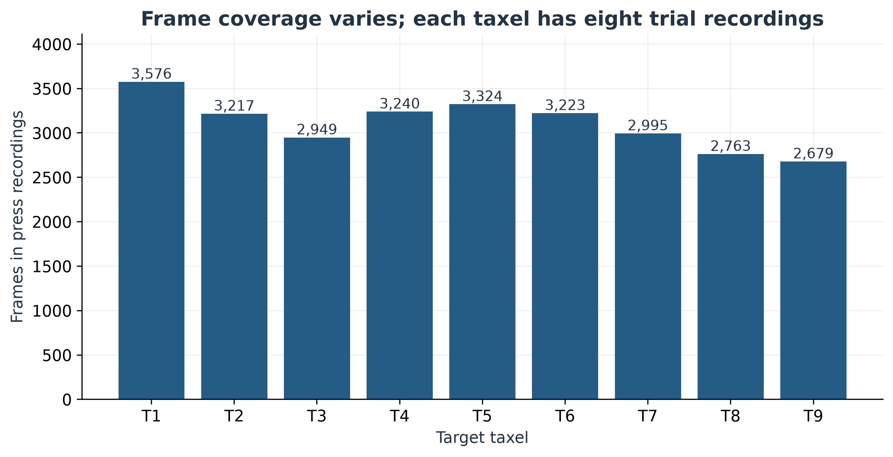
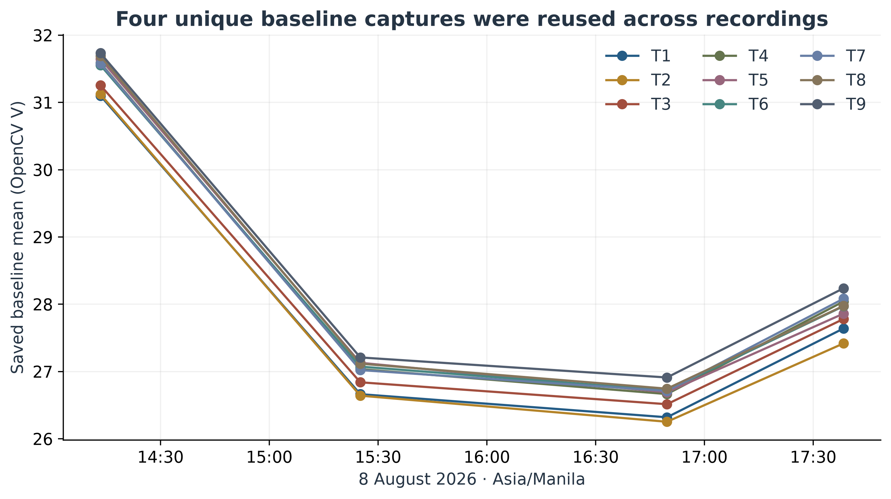
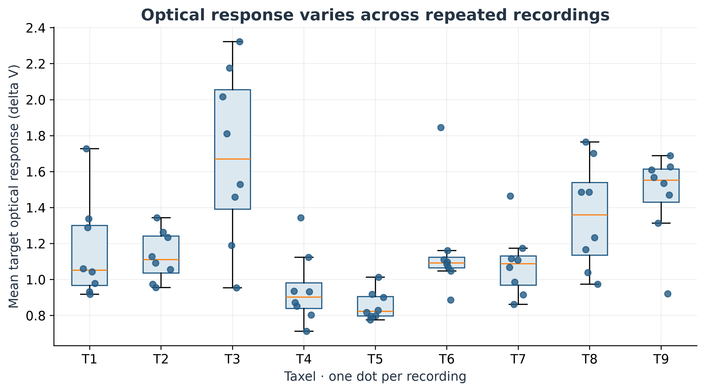
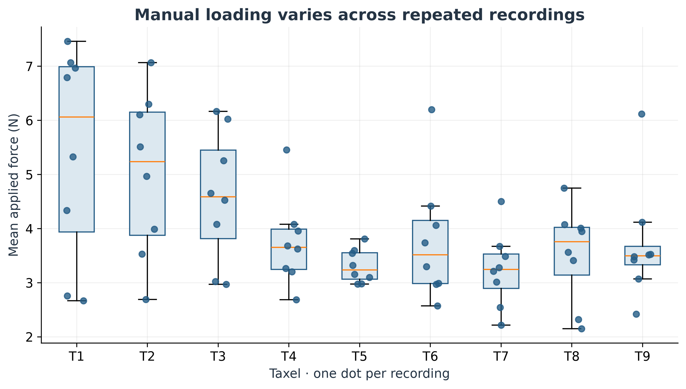
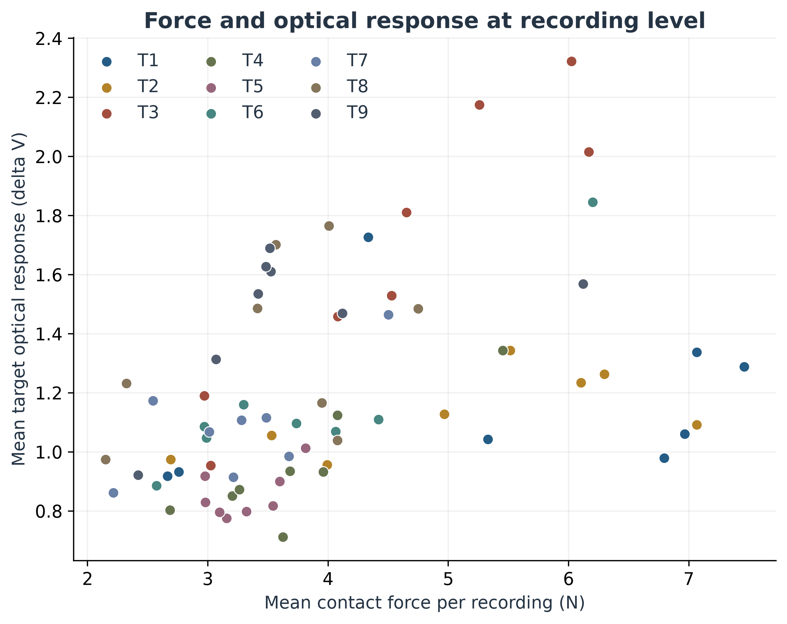
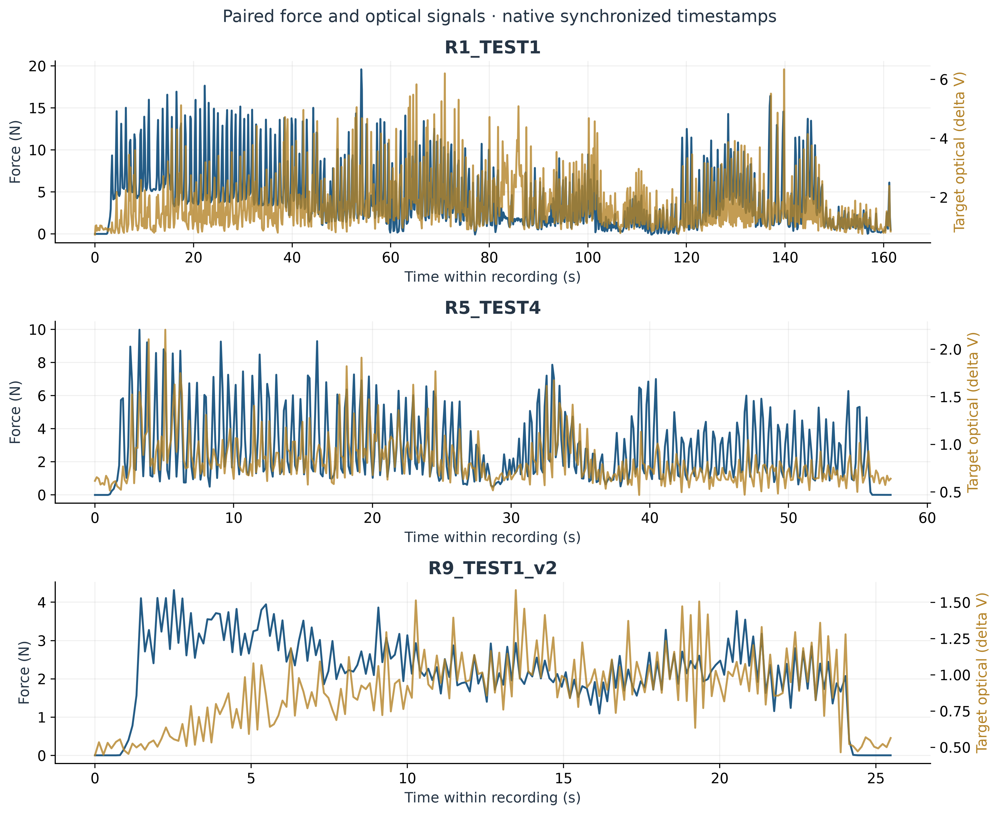
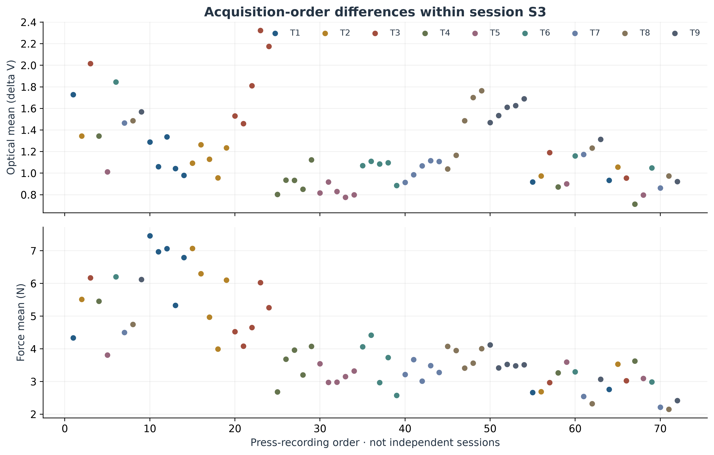
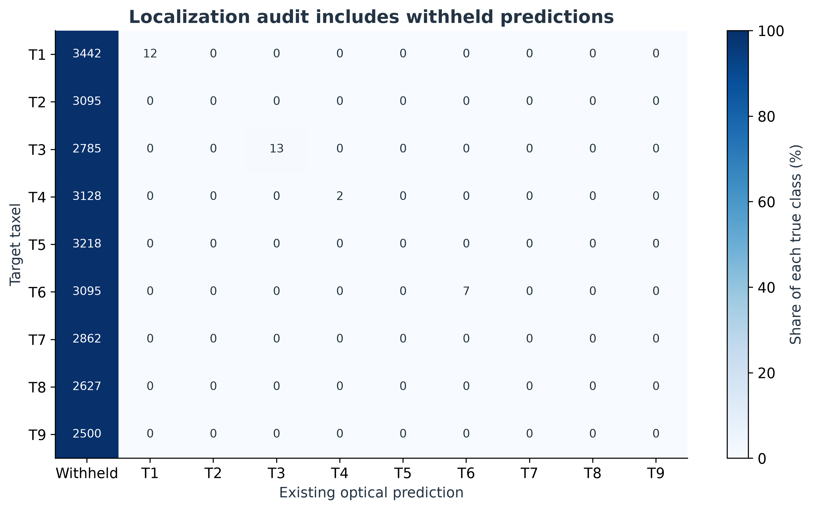

# BAURods Data Quality Report

Manual finger-press acquisition · 8 August 2026 · Prepared 5 October 2026

## Executive summary

The archive is **complete and internally consistent enough for exploratory analysis of the recorded BAURods pipeline**, subject to substantial limits on press-level repeatability and generalization.

- **29,318 / 29,318 camera frames** reconcile with synchronized rows and fully decoded primary videos. All **42,568 raw load-cell samples** reconcile with ingress counts. Required fields are complete.
- **72 press recordings** cover all nine taxels equally, with **eight recordings each**; **11 no-contact recordings** provide a separate baseline check. These are recordings, not a verified count of independent physical presses.
- Across recording means, optical CV is **9.45–28.66%** and manual-force CV is **9.40–36.23%**. The varying input force prevents a pure estimate of sensor repeatability.
- The saved localization rule returns **34 predictions for 26,786 contact frames (0.127% coverage)**. All 34 match the target, but that conditional accuracy does not demonstrate broad localization capability.

All recordings carry **session S3**, were acquired on **8 August 2026**, and are configured to export **motion-magnified optical measurements**. Conclusions therefore apply to this acquisition and processing pipeline, not an independently calibrated raw optical response.

## 1. Dataset Overview

BAURods is a press-activated hollow-rod mechanoluminescent visuotactile array intended for normal-contact detection and discrete localization across nine taxels. Forces were applied by **manual finger pressing**, with a load cell used as the reference. The source archive contains **2,551 files**: 736 CSV, 913 JSON, 83 NPZ, 332 MP4, 404 PNG and 83 log files; no Excel file is present in the archive.

Each of the 83 recording directories contains a 330-column optical feature table, a 349-column synchronized table and a 46-column raw load-cell table. The feature and master tables describe the same **29,318 frames** and must not be added together as separate observations. There are **83 unique trial IDs**, one source session ID (`S3`), one collection day, and four unique saved baseline IDs. The acquisition window is **14:21:30–17:52:02 Asia/Manila**.

The archived dictionary describes `roiN_delta_v_mean` as mean positive per-pixel baseline-corrected V (digital delta V, 0–255). This existing variable is used without inventing a new sensing metric. Recording summaries use its mean and maximum within valid force-derived contact frames. Force is in newtons. `contact_state_derived` uses the saved **0.05 N** threshold, not the trial-wide interaction label.

**Unit of analysis.** A unique directory is called a recording here. Source `trial_id` labels are retained, but there is no physical press ID. The force traces contain repeated excursions; 81 contiguous above-threshold runs occur across 72 press recordings, with five recordings having multiple runs, five starting in contact and 30 ending in contact. Runs may merge repeated presses when force remains above threshold. Therefore 81 is a threshold-run count, not a defensible press count. The primary summaries give each recording equal weight; per-press repeatability cannot be recovered reliably without event annotation.

The workspace file inventory records existing raw/processed/model artifacts. This report's numerical evidence is taken directly from the supplied manual ZIP; automatic-indentation datasets are not pooled into it. Existing workspace split and prediction files are examined only for evaluation integrity.

## 2. Data Integrity and Completeness

Every archive member passed its ZIP CRC read. All 736 CSV files, 913 JSON files and 83 NPZ files parsed. All **83 primary videos were decoded** and their combined frame count matched the accepted-frame counters; auxiliary videos were CRC-checked but not frame-decoded. Common fields in each optical feature table and synchronized table agree.

| Check | Observed valid | Expected from recorded counters | Completeness (%) |
| --- | --- | --- | --- |
| Camera/master records | 29318 | 29318 | 100.000 |
| Feature rows | 29318 | 29318 | 100.000 |
| Decoded primary video frames | 29318 | 29318 | 100.000 |
| Raw load-cell samples | 42568 | 42568 | 100.000 |
| Core-complete synchronized rows | 29318 | 29318 | 100.000 |
| Valid synchronized rows | 29318 | 29318 | 100.000 |

There are **zero missing core force, target-label, optical-channel, timestamp, session-ID or trial-ID values**, zero duplicate feature rows, zero duplicate recording/frame keys, zero missing frame IDs within recordings, and zero skipped raw sample IDs within recordings. All source validity flags used for analysis are true; no raw load-cell row is marked invalid. No observation was excluded from the core analysis for an integrity failure.

The completeness denominator is the **recorded accepted/ingress count**, not an unavailable planned acquisition total. This cannot establish that every intended trial was performed or that no frame was dropped before acceptance. Effective accepted-frame rates are **7.489–7.505 Hz**, despite a requested camera rate of 30 Hz; achieved and requested rate are different quantities.

Literal completeness across all 349 columns is **0 / 29,318 rows**, because optional or inapplicable fields are blank. Examples include automated-printer coordinates, sequence identifiers and optional force-class/press-number labels. Blank `predicted_dominant_roi` entries are documented threshold abstentions. These must not be called missing sensor observations. Exact field types, missing counts and source missing-value rules are supplied in the data dictionary and column-profile tables.

## 3. Experimental Coverage

There are **27,966 frames in 72 press recordings**, including **26,786 force-derived contact frames** and 1,180 within-recording no-contact frames. The eleven dedicated no-contact recordings contain another **1,352 frames**. Thus the total no-contact reference is **2,532 frames**.

| Taxel | Recordings | Press-recording frames | Contact frames | Frame share (%) |
| --- | --- | --- | --- | --- |
| T1 | 8 | 3576 | 3454 | 12.787 |
| T2 | 8 | 3217 | 3095 | 11.503 |
| T3 | 8 | 2949 | 2798 | 10.545 |
| T4 | 8 | 3240 | 3130 | 11.585 |
| T5 | 8 | 3324 | 3218 | 11.886 |
| T6 | 8 | 3223 | 3102 | 11.525 |
| T7 | 8 | 2995 | 2862 | 10.709 |
| T8 | 8 | 2763 | 2627 | 9.880 |
| T9 | 8 | 2679 | 2500 | 9.579 |

Recording counts are exactly equal across the nine taxels. Frame counts range from 2,679 to 3,576, a largest/smallest ratio of 1.335; this reflects unequal durations rather than unequal recording counts. Frame-weighted model results can therefore overweight longer sequences. No arbitrary balance threshold is applied. Dedicated no-contact trials are reported separately even though their metadata retains a target ROI.

## 4. Baseline Stability

Four unique baseline captures were reused across 83 recordings; counting all copied baseline rows as independent captures would exaggerate the evidence. Across taxels and captures, saved mean V ranges from **26.254 to 31.734**. The absolute first-to-last capture change is **11.02–11.96%** by taxel. This is a between-capture shift, not a continuously observed drift trajectory or a proven mechanism.

The 11 dedicated no-contact recordings support 99 recording/ROI traces. Their uncorrected mean-V CVs are **0.312–0.725%**; absolute start-to-end changes are **0.002–0.520%**, comparing means over the first and final 10% of frames (ceiling-rounded windows). These show relatively small fluctuations over the observed short recordings; they do not establish stability throughout the entire experiment. Digital V is not calibrated radiance, so optical CVs are descriptive ratios on this processing scale, not metrological uncertainty.

Positive-corrected no-contact response is nonzero: recording/ROI means span **0.502–0.915 delta V**, with CV **5.50–9.14%** and window drift up to **7.39%**. Positive clipping and the processing pipeline must be considered when interpreting low optical responses.

The saved pre-recording drift statistic spans **0.041–0.621 V units**, below the configured acquisition threshold of **5 V units** in every recording. That is a software gate from the files, not a universal data-quality criterion. NPZ files retain per-pixel mean/median baseline images; their summaries' spatial standard deviations are not temporal standard deviations. The original baseline frame stacks are not supplied, so the baseline-capture temporal distribution cannot be reconstructed. Autofocus and automatic white balance are recorded as enabled in all 83 configurations; their causal contribution to baseline shifts is not established.

## 5. Optical-Response Repeatability

Each taxel contributes **eight recording means** computed over valid force-derived contact frames. The existing target-ROI mean positive delta V is averaged per recording; a separate table summarizes the maximum of that same feature. Between-recording sample SD uses `ddof=1`; CV is 100 × SD / mean. Quartiles use linear interpolation. Outliers remain included.

| Taxel | Recordings | Optical mean ΔV | Optical SD | Optical CV (%) | Force mean (N) | Force SD (N) | Force CV (%) |
| --- | --- | --- | --- | --- | --- | --- | --- |
| T1 | 8 | 1.161 | 0.277 | 23.846 | 5.422 | 1.964 | 36.230 |
| T2 | 8 | 1.131 | 0.139 | 12.302 | 5.020 | 1.510 | 30.074 |
| T3 | 8 | 1.682 | 0.482 | 28.655 | 4.588 | 1.215 | 26.486 |
| T4 | 8 | 0.947 | 0.200 | 21.112 | 3.744 | 0.823 | 21.991 |
| T5 | 8 | 0.856 | 0.081 | 9.453 | 3.310 | 0.311 | 9.405 |
| T6 | 8 | 1.163 | 0.287 | 24.709 | 3.781 | 1.154 | 30.518 |
| T7 | 8 | 1.087 | 0.186 | 17.134 | 3.241 | 0.700 | 21.592 |
| T8 | 8 | 1.356 | 0.297 | 21.898 | 3.529 | 0.892 | 25.277 |
| T9 | 8 | 1.467 | 0.248 | 16.931 | 3.709 | 1.087 | 29.299 |

Mean-response CV ranges from **9.45% (T5) to 28.66% (T3)**. Peak-response CV ranges from **29.56% to 102.12%**, with the largest value at T4. Thus means are less dispersed than maxima under this aggregation. Longer recordings provide more opportunities for high maxima, so the peak comparison is duration-sensitive. Lower dispersion here describes these recordings; it does not isolate sensor repeatability at fixed loading.

All optical measurements are identified by `quantitative_analysis_source` as **Motion-magnified frame**, and `magnified_pixels_used_for_exported_measurements` is true throughout. These results characterize the saved transformed signal. Video decoding verifies frame counts, not pixel-level reproduction of every feature. The magnitude and timing of unprocessed optical responses require a separate feature recomputation from original video.

Physical press boundaries, controlled force levels and independent experimental sessions are unavailable. Consequently, a pure same-force, press-to-press repeatability coefficient and inter-session reproducibility claim are **not supported**. The recording-level result is retained as an honest descriptive surrogate.

## 6. Applied-Force Variability

Mean contact force per recording ranges from **2.149 to 7.459 N**. Within-taxel CV of these means ranges from **9.40% (T5) to 36.23% (T1)**. Peak-force means and full descriptive distributions are included separately; synchronized forces reach **22.699 N**.

Manual force variability is an experimental input variation, not by itself evidence of corrupted measurements. It provides an alternative explanation for differences in optical response, together with loading history, duration and baseline changes. No force normalization or model has been used to erase that variation.

The calibration records document a **200 g reference mass (1.96133 N under the recorded conversion)** and passing stored verification checks. The maximum observed force is about 11.6 times that reference force. The supplied records do not provide a multi-point calibration or uncertainty budget covering the full observed range; reference-force accuracy over that range is therefore not established by this audit. Small negative tared forces occur in **2,154 frames**, reaching **−0.190 N**. They are retained as measured offsets/noise, not automatically declared impossible or clamped to zero.

## 7. Force–Optical Response Relationship

The question is whether paired force and optical recordings exhibit a coherent directional association. Spearman's rank correlation describes monotonic association without imposing a linear calibration model. Across **72 recording pairs**, the correlation of mean contact force and mean target optical response is **ρ = 0.520**. Within-taxel values range from **0.238 to 0.905** (eight recordings each).

The positive pooled trend is compatible with stronger loading often accompanying larger optical responses. It is neither a quality score nor causal evidence. Group-specific results differ: TEST7 has **ρ = −0.433** and TEST1_v2 **ρ = −0.150**, each across nine taxels. Pooling can therefore conceal acquisition-group and taxel effects.

The scatterplots and saved group-specific coefficients are descriptive. No Pearson model is imposed because a stable linear relationship is not established. No p-values, ANOVA or normality-screening tests are reported; independence across recordings is not established, there is only one source session, and each within-taxel sample contains eight recording summaries. An independent-session confidence interval is consequently unavailable. No multiple-comparison claims are made. [SciPy's Spearman documentation](https://docs.scipy.org/doc/scipy/reference/generated/scipy.stats.spearmanr.html) describes the coefficient used here.

## 8. Temporal Synchronization

The camera and load-cell records contain a shared host-monotonic time base. Recomputing the nearest physical load-cell sample reproduces every stored synchronization offset exactly. Independently interpolating raw force on that time base reproduces synchronized force with maximum absolute numerical difference **1.46 × 10⁻¹² N**.

For **29,318 frames**, signed camera-minus-nearest-load-cell timestamp offset is **mean 1.298 ms**, **median −0.323 ms**, **SD 26.799 ms**, **IQR 43.623 ms**, and **range −80.268 to 83.430 ms**. Median absolute nearest-sample gap is **22.059 ms**, with maximum **83.430 ms**, below the recorded **200 ms** matching gate. There are no non-increasing host timestamps within either stream.

These values assess **timestamp matching**, not physical sensor response time. A deterministic exploratory cross-correlation searches ±1 s after resampling at each recording's median frame interval; its selected lag has median **0.129 s** and range **−0.262 to 0.917 s**. This is approximately frame-scale and depends on waveform shape, repeated loading, interpolation and optical magnification. It cannot identify intrinsic mechanoluminescent latency, and the ±1 s search bound is an analysis setting rather than a validated acceptance threshold. Detailed estimates and boundary flags are saved for inspection.

Representative overlays use R1_TEST1, R5_TEST4 and R9_TEST1_v2, selected by fixed trial identifiers. Optical and force peaks are not automatically paired as if each recording were one press.

## 9. Outlier and Anomaly Assessment

Within each taxel, 1.5 × IQR fences were applied separately to recording mean/peak force and mean/peak optical response. This produces **23 variable-level statistical flags**; a recording can appear more than once. Every flagged value is retained. Such a flag does not demonstrate corruption, particularly under variable manual loading and unequal recording duration.

There are **eight trial-label conflicts**: R2_NOCONTACT through R9_NOCONTACT carry the fixed interaction label `Press`, although their names indicate no contact and every force-derived frame is non-contact. The three R1_NOCONTACT_v2 recordings use `none`. The report uses the trial names to distinguish dedicated no-contact recordings, verifies their force states, and preserves all original labels.

No corrupted core row was confirmed. Confirmed problems concern label semantics and insufficient physical-press identifiers. The row/trial-level anomaly log records variable, value, bounds/reason, retention decision and justification. Feature-range checks found no negative or >255 mean positive delta V, and all target labels are in 1–9. Negative tared force is reported separately without automatic exclusion.

## 10. Session-to-Session Consistency

A true session-to-session comparison cannot be performed: all records have the source session label **S3**, one sensing-skin identifier and one acquisition date. Directory names uniquely identify 83 recordings; they do not demonstrate 83 independent experimental sessions. The existing feature-store convention uses the word session for these directories, which must be distinguished from the source label.

Acquisition-order plots and TEST-group descriptive tables are provided instead. They retain all taxels and show changes within the collection period, including four distinct baseline captures and changing force inputs. These are within-session, partly confounded differences; no causal session effect or across-day reproducibility is claimed. The baseline-capture means shift by roughly 11–12% from first to last even though the short no-contact recordings have small within-run V variation. Both scales matter.

## 11. Dataset Leakage / Evaluation Integrity

Two evaluation designs coexist in the workspace and should not be conflated.

**Later manual-only split manifest.** All **83 / 83 directory identities** map one-to-one to the supplied archive. The manifest assigns 54 model-primary recordings (TEST1–TEST6; 24,453 frames), 11 no-contact recordings (1,352 frames) and 18 replay-only recordings (3,513 frames). Recomputing all six outer folds finds **zero recording overlap and zero recording/frame-key overlap** between training and holdout, with all nine taxels on both sides. Each outer fold holds out nine recordings and trains on 45. Source experimental session S3 remains shared in all folds; two baseline IDs are shared in folds 2–6. This is within-session grouped evaluation, not an independent-day validation. The split audit does not certify every fitted transform or later model-tuning decision.

**Legacy linear-model results.** The existing out-of-fold file contains **8,559 rows from nine recordings**, all matching directory identities in the supplied archive. **All nine recordings occur in multiple folds.** The corresponding script partitions each recording into five contiguous blocks. Training and testing therefore share the same physical acquisition sequences; unannotated presses may cross boundaries. This establishes within-recording dependence risk, although exact same-press overlap cannot be counted without press IDs. The script points to an older archive path, so complete source equivalence is not established by matching names alone.

Use the whole-recording or whole-TEST-group folds for within-session evaluation, and collect separate sessions/days for generalization claims. Fit any thresholds, scalers and feature selection on training data only. Existing reported model evaluations were not altered or replaced; the new performance appendix audits only predictions saved in the supplied ZIP.

## 12. Overall Data-Quality Assessment

The supplied manual dataset demonstrates **complete accepted-frame capture records, internally consistent force synchronization, traceable calibration/baseline metadata and equal trial-recording coverage across nine taxels**. These strengths support descriptive exploration of the recorded BAURods processing pipeline and transparent within-session evaluation.

The evidence also shows **unequal manual forces, changing saved baselines, repeated loading within recordings, inconsistent no-contact trial labels, one-session coverage and motion-magnified optical measurements**. Recording-level optical dispersion is quantified, but the dataset does not establish fixed-force per-press repeatability, inter-session reproducibility, absolute optical calibration or intrinsic sensor latency. The saved localization threshold has extremely low coverage and cannot support a broad localization claim based on conditional accuracy alone.

For the thesis, describe these findings as an **exploratory feasibility assessment with qualified data integrity**, not proof that the sensor is superior or universally reliable. Preserve the recording/frame hierarchy, disclose the processing source, retain statistical outliers, and state the evaluation split used beside each performance result.

The most useful follow-up is to annotate physical presses in the existing video and then acquire independent sessions with measured loading ranges and documented camera/processing settings. A multi-point load-cell verification across the observed force range would address the reference-force uncertainty. These are recommendations; they were not fabricated as completed experiments.

## Appendix A. Sensor performance, separate from data quality

This appendix evaluates the **existing thresholded dominant-ROI predictions stored in the supplied ZIP**, not subsequently trained workspace models. The source configurations set a localization threshold of **5 mean delta V**. The force-derived reference class uses **0.05 N**; target ROI is treated as localization truth only during contact.

Of **26,786 contact frames**, **34** have a prediction and all 34 match the selected taxel: conditional accuracy **100%**, coverage **0.126932%**. Counting withheld predictions as failures gives overall correct localization **0.126932%** and macro-F1 **0.002439**. There are no predictions for T2, T5, T7, T8 or T9. Undefined precision for a class with no predictions is set to zero for the explicitly reported macro-F1 convention; it must not be read as a measured false-positive fraction.

| Taxel | Contact frames | Predicted | Correct | Coverage (%) | Precision | Recall | F1 |
| --- | --- | --- | --- | --- | --- | --- | --- |
| T1 | 3454 | 12 | 12 | 0.347 | 1.000 | 0.003 | 0.007 |
| T2 | 3095 | 0 | 0 | 0.000 | 0.000 | 0.000 | 0.000 |
| T3 | 2798 | 13 | 13 | 0.465 | 1.000 | 0.005 | 0.009 |
| T4 | 3130 | 2 | 2 | 0.064 | 1.000 | 0.001 | 0.001 |
| T5 | 3218 | 0 | 0 | 0.000 | 0.000 | 0.000 | 0.000 |
| T6 | 3102 | 7 | 7 | 0.226 | 1.000 | 0.002 | 0.005 |
| T7 | 2862 | 0 | 0 | 0.000 | 0.000 | 0.000 | 0.000 |
| T8 | 2627 | 0 | 0 | 0.000 | 0.000 | 0.000 | 0.000 |
| T9 | 2500 | 0 | 0 | 0.000 | 0.000 | 0.000 | 0.000 |

No independent optical contact-detector output is stored. Prediction availability can be reported only as a **detection proxy**: TP 34, FN 26,752, FP 0 and TN 2,532. This gives sensitivity **0.126932%** and specificity **100%**, relative to the load-cell threshold. It does not validate a dedicated contact detector. Comparing `contact_state_derived` against the same force threshold would be circular. Metrics here are frame-weighted descriptions of dependent observations, with no independent-frame confidence interval.

## Appendix B. Reproducibility and scope

The original ZIP is preserved. Its SHA-256 is `e039dcd49f3390d34dc979490dcf46a6ecc43d9e6a2aec08e4952acc14b5006a`, matching the repository's recorded source identity before and after the analysis. Tables retain original field precision; displayed values are rounded. A compact frame-level derivative, file hashes, source dictionaries, field profiles, logs and recording summaries accompany this report.

**Verification:** all 21 primary reconciliation checks passed, including full decoding of primary videos. A separate source-read calculation reproduced **360 summary cells** with maximum absolute difference **7.11 × 10⁻¹⁵**, and reproduced the Spearman coefficient by correlating ranks. Counts in tables, figures and performance denominators reconcile. These checks establish numerical and record integrity, not experimental ground-truth accuracy.

**Statistical scope:** sample SD uses n−1; IQR = Q3−Q1; CV = 100 × SD / mean for positive means. CV is not reported for signed timing offsets. Optical CV is a descriptive digital-signal ratio and is not interchangeable with relative physical uncertainty. [NIST's coefficient-of-variation guidance](https://www.itl.nist.gov/div898/software/dataplot/refman2/auxillar/coefvari.htm) explains the ratio-scale and near-zero-mean limitations. No hypothesis tests or acceptance thresholds were invented.

**Unavailable analyses:** true per-press statistics, independent-session comparisons, baseline-capture temporal variance, multi-point force uncertainty, raw-versus-magnified optical agreement and physical sensor latency. Acquisition counters cannot establish adherence to an unavailable experimental schedule. Existing learned models were not retrained or re-scored.

**Delivery:** fifteen figures are supplied as 320 dpi PNG and vector SVG, with CSV tables and runnable Python scripts. The notebook is a companion interface to the same workflow. The Markdown report and separate thesis subsection are derived from these reviewed results.