# Global Sensor Characterization of BAURods

Physical analysis: 5 October 2026. Model evidence integration: 6 October 2026. Experimental acquisition: 8 August 2026, Asia/Manila. Source: `Manual Calibration (2).zip`.

BAURods demonstrates useful **model-assisted contact discrimination and nine-region localization** across the integrated 3 × 3 sensing skin. The strongest supported system-level results are **98.50% contact balanced accuracy**, **84.40% localization accuracy**, and **0.499 N force MAE**, from retrospective nested grouped evaluation. These results complement the global physical response analysis of **5,357 retained repeated presses across 72 recordings**. The physical analysis establishes measurable optical response and known-contact spatial discrimination; the learned models quantify what can be inferred from richer optical features within their evaluated interval.

The model results use original, unannotated video features and six complete held-out TEST groups, with equal total weight for each recording. Force and localization use 7,154 eligible frames from 54 primary press recordings within 0.05–3 N. Contact adds 1,352 no-contact frames from 11 recordings (8,506 frames; 65 recordings total). These are correlated frame observations, not 8,506 independent contact events. The model protocol excludes 18 replay-designated recordings included in the broader 72-recording pulse analysis. Both analyses trace to the same manual archive; they are complementary evaluations, not independent replication. The recordings were collected on 8 August 2026; 9 September refers to saved model experiments, not new acquisition.

The learned pipelines were evaluated offline and were not installed into the live acquisition GUI. The archived 5-V acquisition gate remains a separate diagnostic with 0.597% press recall. Its result does not describe the later learned detector. Conversely, the learned detector's frame scores cannot be substituted for that gate's event-level performance or presented as prospective sensor validation.

### Model-assisted sensing performance

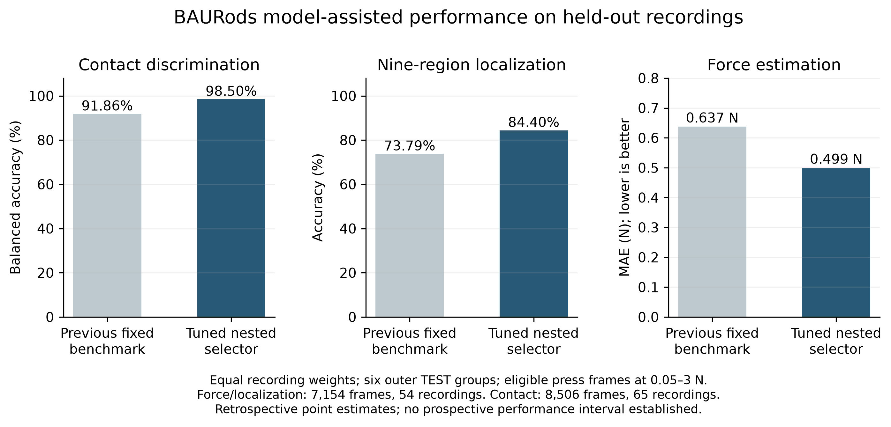

| Model-assisted characteristic | Previous fixed model | Tuned nested selector |
| --- | --- | --- |
| Contact balanced accuracy | 91.86% | 98.50% |
| Contact accuracy | 91.91% | 97.51% |
| Contact recall | 91.93% | 97.00% |
| Contact specificity | 91.80% | 100.00% |
| Contact macro F1 | 0.871 | 0.958 |
| Nine-region localization accuracy | 73.79% | 84.40% |
| Localization macro F1 | 0.740 | 0.848 |
| Joint correct contact and region | 70.50% | 83.61% |
| Force MAE | 0.637 N | 0.499 N |
| Force RMSE | 0.770 N | 0.632 N |
| Force R² | -0.030 | 0.306 |

The fixed comparators are Extra Trees for force, logistic regression for localization and Random Forest for contact, selected retrospectively from the fixed benchmark. The tuned headline is the complete nested selector, not the most favorable family chosen after inspecting outer scores. Force MAE decreased by 21.68%, localization accuracy increased by 10.62 percentage points, and contact balanced accuracy increased by 6.64 points on matched held-out frame identities. These gains are retrospective and were not uniform across force bins or locations. [Model report, Tables 9–20](model_report_review/evidence/Manual_Calibration_Models_Technical_Report.pdf).

## Global Characterization of the BAURods Visuotactile Sensing Skin

| Sensor characteristic | Global BAURods result | Interpretation / scope |
| --- | --- | --- |
| Valid segmented physical presses | 5,357 events, clustered in 72 press recordings | Force-only segmentation; not all statistically independent |
| Sensing area | All nine locations of one 3 × 3 BAURods skin | Taxel is a secondary grouping variable |
| Acquisition scope | 83 recordings; one session S3 on 8 August 2026 | Four baseline/settings blocks, not four independent days |
| Tested peak-force range | 1.1512–23.3004 N | Retained presses; not maximum sensor capacity |
| All raw reference-force range | -0.2867–23.3004 N | Negative unloaded offsets included |
| Optical-response range | 0.7071–8.5698 V digital units | Peak maximum ROI mean positive delta-V from magnified images |
| Global force–response relationship | S = 0.90855 + 0.12106 F | Descriptive pooled association; no intrinsic calibration established |
| Global slope / apparent sensitivity | 0.12106 V digital units/N; 95% CI 0.08885 to 0.14901 | Processing- and protocol-dependent; not intrinsic material sensitivity |
| Model fit | R² = 0.2229; RMSE = 0.7045 V | In-sample, press-level |
| Validation | Recording-held-out R² = 0.1934; RMSE = 0.7178 V | Model selection used this CV; no final untouched test set |
| Repeatability proxy | Residual SD = 0.7046 V; IQR = 0.8394 V | Conditional dispersion under manual loading; not controlled metrological repeatability |
| Baseline variability | Global mean = 0.8980 V; RMS temporal SD = 0.0437 V | 11 recording-equal no-contact controls |
| Statistical force detection threshold | Not quantitatively assessed | No validated replicated low-force staircase; segmentation excludes excursions <0.5 N |
| Lowest observed detected press peak | 1.8699 N | One observed peak, not a reliable threshold |
| Configured optical decision criterion | 5 V digital units | Already present in acquisition software; not 5 N |
| SNR proxy | Median = 18.406; IQR = 23.600 | (Peak response − global no-contact mean) / RMS temporal SD |
| Response time | Not quantitatively assessed | Sparse samples and narrow-band magnification prevent intrinsic latency inference |
| Recovery time | Not quantitatively assessed | Repeated presses generally retain residual load and have no stable release baseline |
| Hysteresis | Not quantitatively assessed | No controlled comparable quasi-static loading/unloading protocol |
| Operating limit / saturation | Not quantitatively assessed | Tested force maximum is not a failure or saturation limit |
| Archived-gate contact accuracy | 0.801% (43/5368) | Unequal positive/negative units; report recall and specificity alongside |
| Archived-gate contact recall | 0.597% (32/5357) | Existing 5-V rule |
| Archived-gate specificity | 100.00% (11/11) | 11 one-second no-contact controls |
| Archived-gate localization accuracy | 0.597% | All valid press events; below-threshold outputs count as failures |
| Archived-gate localization macro F1 | 0.01135 | Nine target classes; no-detection column retained |
| Known-contact location discrimination | 94.307% accuracy; macro F1 = 0.94437 | Offline ungated argmax diagnostic, not archived end-to-end performance |

## 1. Global Response Definition

The acquisition pipeline uses OpenCV HSV **V (brightness)**, not hue or saturation as the response. For ROI i at time t, it forms `I_i(t) = mean_p[max(V_magnified(p,t) − B_i(p), 0)]`, where B is the captured per-pixel baseline median after the software's integer conversion. The frame-level global metric is `G(t) = max_i I_i(t)`, exported as `dominant_intensity`. For press e, the primary response is **`S_e = max_(t in e) G(t)`**. The reference is **`F_e = max_(t in e) F_raw(t)`**, using the higher-rate load-cell samples. Units are **V digital units**, based on 8-bit image values, not volts, lux, physical light power or generic HSV units. Force is in newtons.

This choice follows the existing algorithm: it selects the ROI with the greatest mean positive delta-V and emits its location when the value reaches 5 V units. The metric is independent of the known pressed location, does not weight unequal ROI areas by pixel count, and gives one sensor-level response for a press anywhere on the array. The positive pixel subtraction already corrects against the captured baseline. A positive unloaded noise floor remains because negative differences are clipped and a maximum is selected. We retain this floor and an intercept rather than forcing zero response at zero force.

**All 83 archived CSV exports were computed from color-magnified images**, with amplification 30 and a 1.1–1.2 Hz temporal passband in the saved configuration. Therefore these are properties of BAURods plus this acquisition/processing configuration. They are not raw-light material constants. Original-video feature-store values are used only as a separately labelled diagnostic after verifying the source ZIP identity, every input Parquet hash, frame count and force alignment. They do not replace the archived software results.

Alternatives were compared without selecting the best-looking correlation: maximum across ROIs (primary), sum of ROI means (includes distributed noise and common-mode changes), response in the known pressed ROI (requires ground truth), response nearest the force peak (timing diagnostic), and original-video response (source diagnostic). `response_definition_comparison.csv` preserves these comparisons. The sum here is a sum of ROI **means**, not a sum of all pixels. Force and optical event peaks can occur at different times; their association describes pulse amplitudes, not a synchronized pointwise constitutive law. The nearest-force-peak response has R² 0.0274, substantially below the paired pulse-amplitude model; timing is a material qualification. The original-video diagnostic has R² 0.2317. Pipeline definitions can be inspected in [feature extraction](../../calibration_gui/processing/feature_extraction.py) and [localization](../../calibration_gui/processing/localization.py).

### Experimental unit and press segmentation

The operator confirmed that the rapid loading pulses were separate finger presses. The raw load-cell trace identifies candidate peaks with prominence at least **0.5 N** and a minimum sample separation corresponding to **0.15 s** (two raw samples at the observed cadence). This allows fast pulses to remain distinct rather than forcing nearby presses into one interval. Adjacent force minima define non-overlapping optical windows `[start, end)`. A retained event must rise and fall by at least 0.5 N, have a peak above the recorded 0.05-N force contact criterion, contain at least three valid camera samples, and have a camera sample within 0.15 s of the force peak. The selected force peak must also be the maximum within its interval; unresolved intervals are rejected. **2000 candidates were excluded** with reason codes. Optical magnitude and localization correctness never determine eligibility. The camera-sample requirement preferentially removes the fastest pulses and is an explicit sampling limitation.

The 0.5-N segmentation prominence is an analyst-defined pulse-separation rule, not a sensor detection threshold. The comparison at 0.25, 0.5 and 1.0 N gives 5,356–5,443 events, with pooled slopes 0.11973–0.12246 V units/N. This limited sensitivity check supports the stability of the main descriptive conclusion to prominence choice; it does not certify the count. A four-page segmentation atlas is supplied for all 72 press recordings. Peaks with insufficient unloading, unresolved multiple pulses, very small force excursions and recording-edge partial presses cannot be certified individually. No claim is made that the inferred count equals a manually annotated ground-truth press count.

The archive contains **29,318 camera rows** and **42,568 raw load-cell samples** in 83 files. There are 72 press recordings (eight per location) and 11 no-contact controls. Eight NOCONTACT files retained a `Press` interaction label; their filenames and measured |F| < 0.05 N identify them as controls. The remaining three are explicitly labelled `none`. All frame validity checks pass. There are four captured baseline/settings blocks but only **one session label S3**, one sensing skin and one collection day. Recordings, not frames or alleged separate acquisition days, are the resampling clusters.

The pooled fit gives every retained physical press equal weight. Confidence intervals resample complete recordings **within each taxel**, preserving the nine fixed sensing locations (2,000 bootstrap replicates, seed 20261005). Taxel is not treated as nine separate sensors or as nine independently manufactured specimens. The intervals describe recording-to-recording uncertainty within this experiment; they do not establish between-device or between-day reproducibility. They condition on recorded force and do not include independently assessed load-cell calibration uncertainty. Model validation holds out whole recordings, never random frames or presses from the same recording.

## 2. Tested Force and Response Range

Retained press peaks span **1.1512–23.3004 N** and their global responses span **0.7071–8.5698 V units**. The full raw reference-force series spans -0.2867–23.3004 N, including slightly negative unloaded offsets. Negative offsets were retained as source values; no speculative per-press zero adjustment was made. Mean peak force was 7.8125 N (SD 3.1172); mean optical response was 1.8543 V (SD 0.7993).

These are **tested ranges**, not maximum sensing limits. Different force coverage, duration, loading rate and baseline/settings blocks prevent attribution of pooled flattening or compression to material saturation. A pixel-level `saturation_warning` is a separate image-clipping diagnostic; it is not proof of force saturation. 0 retained presses included an exported pixel-saturation warning.

| variable | unit | n | mean | sd | median | q1 | q3 | iqr | minimum | maximum | cv_percent | mean_ci95_low | mean_ci95_high |
| --- | --- | --- | --- | --- | --- | --- | --- | --- | --- | --- | --- | --- | --- |
| Peak force per press | N | 5357 | 7.8125 | 3.1172 | 7.3306 | 5.4706 | 9.7146 | 4.2441 | 1.1512 | 23.3 | 39.901 | 7.2146 | 8.316 |
| Peak global optical response per press | V digital units | 5357 | 1.8543 | 0.79928 | 1.7026 | 1.2434 | 2.2751 | 1.0317 | 0.70712 | 8.5698 | 43.103 | 1.696 | 2.0159 |
| Force excursion per press | N | 5357 | 5.2902 | 2.7528 | 4.96 | 3.0963 | 6.9856 | 3.8893 | 0.54086 | 19.115 | 52.035 | Not available | Not available |
| Force-defined pulse duration | s | 5357 | 0.57402 | 0.26208 | 0.54896 | 0.44851 | 0.64321 | 0.1947 | 0.26113 | 3.4906 | 45.657 | Not available | Not available |
| Peak excess / pooled baseline temporal SD | dimensionless | 5357 | 21.875 | 18.282 | 18.406 | 7.9006 | 31.5 | 23.6 | -4.3654 | 175.48 | 83.575 | Not available | Not available |
| No-contact recording mean global response | V digital units | 11 | 0.89797 | 0.033158 | 0.90729 | 0.87513 | 0.91414 | 0.039006 | 0.85497 | 0.96365 | 3.6925 | 0.87944 | 0.9169 |
| Captured baseline global raw V mean | V digital units | 4 | 28.238 | 2.2241 | 27.43 | 26.882 | 28.787 | 1.905 | 26.615 | 31.475 | 7.8764 | Not available | Not available |

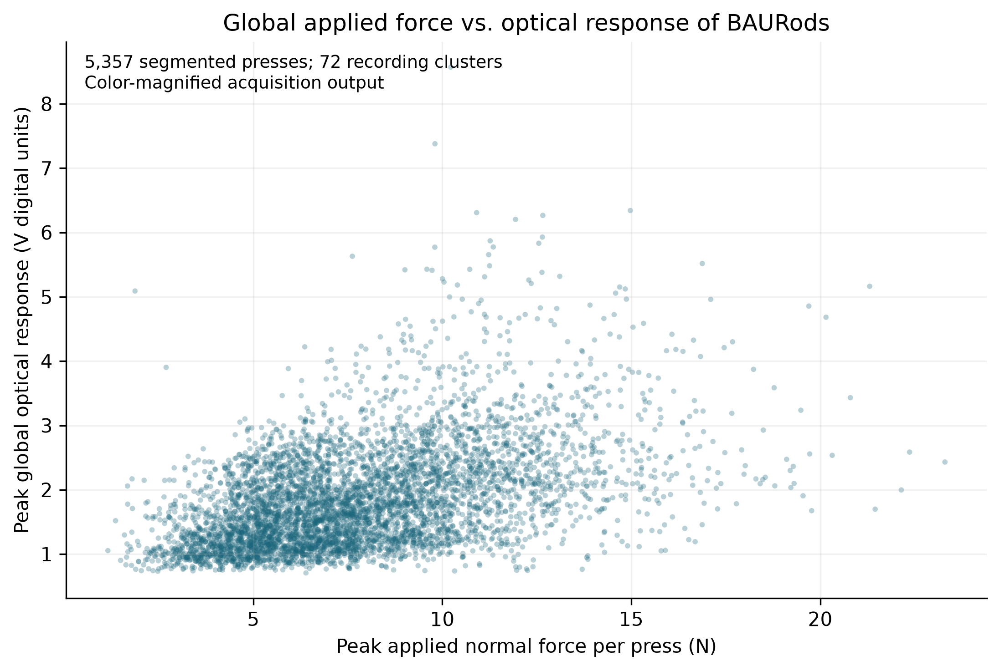

## 3. Global Force–Response Behavior

The selected parsimonious descriptive model was **linear**, with equation **S = 0.90855 + 0.12106 F**, where F is press peak force in N and S is peak global response in V digital units. In-sample R² was **0.2229** and RMSE was **0.7045 V**. Recording-held-out R² was **0.1934** and RMSE was **0.7178 V**. Intercept CI was 0.73517–1.09366. Parameters and intervals are exported separately.

Linear, quadratic, logarithmic and power-law models were compared with a constant-response benchmark. Fits minimize squared errors in original response units; the power model is not selected by a log-transformed R². The one-standard-error rule compares recording-equal cross-validation RMSE and favors the simplest adequate force-dependent form. The constant benchmark remains an adequacy check, even when a force-dependent line is presented for interpretation. No high-order polynomial or post-hoc force range was searched to increase R². Validation here supports exploratory model comparison, not an untouched confirmatory performance estimate.

| model | n | parameters | r2 | rmse | mae | recording_cv_rmse | recording_cv_r2 | mean_recording_rmse | se_recording_rmse |
| --- | --- | --- | --- | --- | --- | --- | --- | --- | --- |
| constant | 5357 | 1 | 0 | 0.7992 | 0.61046 | 0.81066 | -0.028893 | 0.68336 | 0.03558 |
| linear | 5357 | 2 | 0.22292 | 0.70451 | 0.52771 | 0.71776 | 0.19342 | 0.57024 | 0.033165 |
| quadratic | 5357 | 3 | 0.22478 | 0.70367 | 0.5265 | 0.72044 | 0.18739 | 0.57019 | 0.033519 |
| logarithmic | 5357 | 2 | 0.21152 | 0.70966 | 0.53139 | 0.72223 | 0.18335 | 0.57513 | 0.033194 |
| power | 5357 | 2 | 0.22228 | 0.7048 | 0.52702 | 0.7181 | 0.19265 | 0.56898 | 0.033443 |

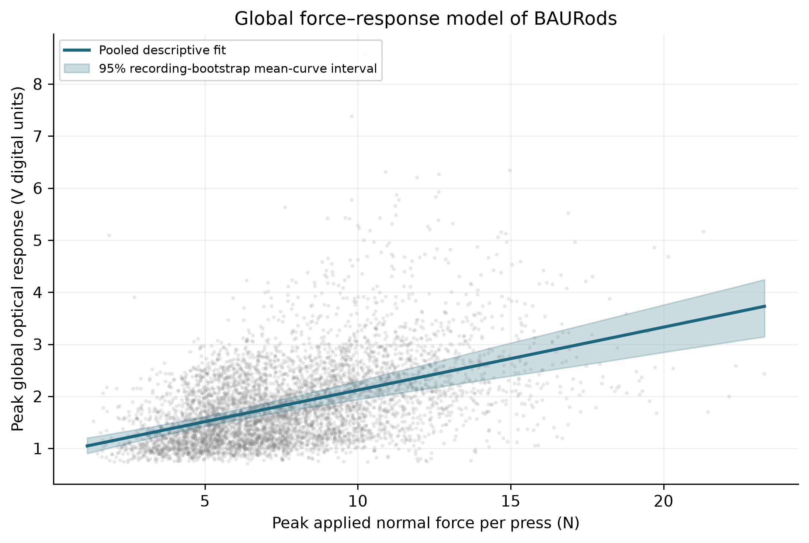

## 4. Sensitivity and Linearity

<!-- MODEL EVIDENCE START -->
### Model-assisted force estimation

The learned optical-to-force pipeline attained **MAE 0.499 N, RMSE 0.632 N and R² 0.306**, with signed bias +0.078 N, on recording-balanced held-out frames within 0.05–3 N. This provides a practical force-estimation result alongside the scalar response curve. The two regressions have different targets: the physical curve predicts V digital units from peak force; the learned model predicts N from multivariate original-video features. Their RMSE and R² must not be ranked against one another. The learned model does not establish intrinsic sensitivity or linearity.

The pooled MAE reduction of 21.68% supports improved retrospective estimation, with a clear remaining limitation: force MAE worsened in each of the four bins below 2 N. Below 0.5 N, tuned MAE was 1.241 N. Gains therefore concern the pooled evaluated distribution, not uniformly precise light-contact sensing. [Model report, Tables 9 and 17](model_report_review/evidence/Manual_Calibration_Models_Technical_Report.pdf).

### Apparent optical slope

<!-- MODEL EVIDENCE END -->

The pooled apparent slope was **0.12106 V digital units/N** (95% recording-bootstrap CI 0.08885–0.14901). This is a slope for the complete optical acquisition pipeline under this manual protocol. It does not establish intrinsic mechanoluminescent sensitivity or a transferable force calibration.

R² is a measure of explained dispersion within these observations, not proof of sensor quality. The residual plot, force-decile residual means and normal-probability diagnostic show departures that an R² alone conceals. Between-recording shifts and uneven force coverage can generate a pooled slope without establishing within-location force linearity. No validated linear operating interval, linearity-error specification or force inversion accuracy is established by this experiment. Baseline/settings and taxel-adjusted models are secondary checks, not nine independent sensitivity claims.

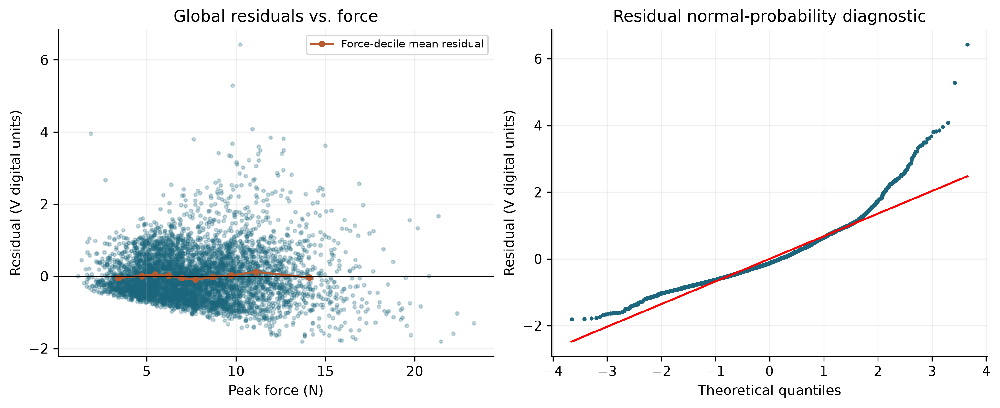
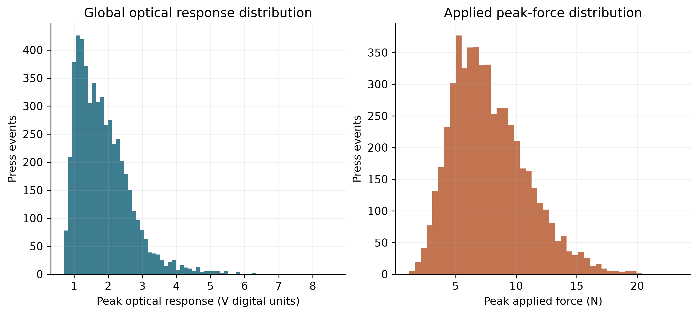

## 5. Repeatability

Residual SD around the global model was **0.7046 V**, with residual IQR **0.8394 V**. This measures force-conditioned dispersion under the manual protocol. It includes spatial differences, recording changes, loading rate, processing memory and model misspecification. It is not a controlled repeatability standard deviation at a fixed force and fixed location.

Empirical force tertiles supply comparable-force summaries without treating their raw response CV as a global repeatability claim. The pooled raw optical-response CV (43.10%) is descriptive only because force varies. Individual presses remain nested in recordings throughout uncertainty analysis.

| force_band | events | recordings | min_force_N | max_force_N | response_mean_V | response_sd_V | response_cv_percent | residual_sd_V | residual_rmse_V | residual_iqr_V |
| --- | --- | --- | --- | --- | --- | --- | --- | --- | --- | --- |
| (1.1500000000000001, 6.121] | 1786 | 69 | 1.1512 | 6.1204 | 1.4801 | 0.52252 | 35.302 | 0.50353 | 0.50341 | 0.67671 |
| (6.121, 8.85] | 1785 | 58 | 6.1208 | 8.8488 | 1.7567 | 0.64077 | 36.475 | 0.63694 | 0.63835 | 0.83501 |
| (8.85, 23.3] | 1786 | 51 | 8.8499 | 23.3 | 2.326 | 0.92803 | 39.898 | 0.90934 | 0.90997 | 1.0957 |

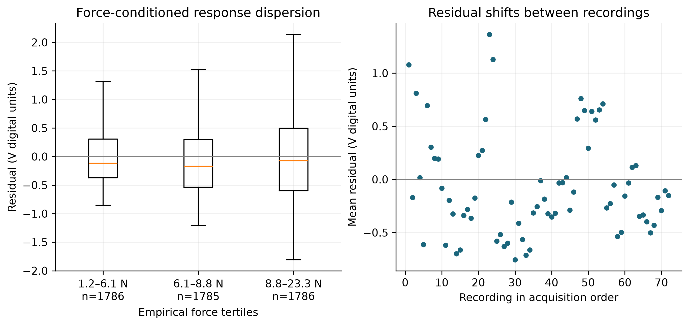

## 6. Baseline Stability

The 11 unloaded recordings produced a recording-equal global mean response of **0.8980 V** (95% recording-bootstrap interval 0.8794–0.9169). The root-mean-square within-recording temporal SD was **0.0437 V**, giving a temporal-noise CV of 4.87%. The SD of the 11 recording means was 0.0332 V. Temporal SD, between-recording SD and spatial dispersion of baseline image pixels are different quantities and are not substituted for one another.

The baseline table reports each recording's descriptive drift slope in V/min. It does not treat individual frames as replicates for confidence limits. Captured baseline image means are summarized once per unique baseline ID (four observations), not duplicated for every frame. Camera saturation and sharpness controls changed across baseline blocks, while autofocus and automatic white balance were enabled in the inspected configurations. Baseline shifts therefore cannot be assigned solely to sensor drift. No long-term or between-day stability estimate is possible from this single collection day.

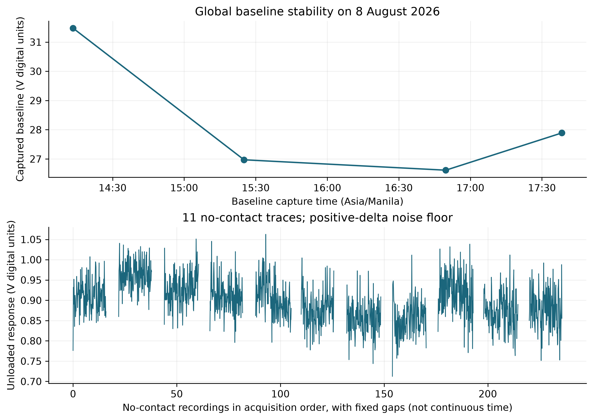

## 7. Detection Characteristics

<!-- MODEL EVIDENCE START -->
### Learned contact discrimination

The tuned nested detector achieved **98.50% balanced accuracy**, **97.00% recall**, **97.51% accuracy**, and **macro F1 0.9581**. Specificity and precision were both 100% on the observed dedicated controls. This is the principal model-assisted contact result: optical features distinguish eligible contact frames from unloaded recordings well under the archived conditions. The zero observed false-positive rate rests on only 11 no-contact recordings and does not establish zero deployment risk. No pooled tuned ROC-AUC is claimed because fold-selected score scales differ.

These metrics use recording-balanced frames within the model study's 0.05–3 N press interval. They do not count physical contact episodes or characterize onset/release. The final saved contact score threshold, 0.3268598318, belongs to its trained preprocessing, SVC score mapping and causal smoothing. It is neither an optical-brightness threshold nor a force limit of detection. [Model report, Tables 11, 14 and 22](model_report_review/evidence/Manual_Calibration_Models_Technical_Report.pdf).

### Archived acquisition gate and baseline diagnostics

<!-- MODEL EVIDENCE END -->

The existing acquisition rule reports a taxel only when the global response reaches **5 V digital units**. Applied once per retained press at its strongest global response, this rule detected **32/5357 presses (0.597% recall)**. Each unloaded recording contributes one centered 1-s control interval: **11/11** were negative, for specificity 100.00% (Wilson 95% interval 74.12–100.00%). Controls share session/baseline conditions, so this interval is conditional on treating recordings as replicates.

Precision was 100.00%, F1 was 0.01188, and accuracy was 0.801%. Accuracy is dominated by the large number of loaded events and is not a balanced estimate across contact/no-contact situations. ROC-AUC of the event response score was 0.93884; it is exploratory, uses only 11 control recordings, and compares pulse maxima with fixed-window maxima. The optical score is not a calibrated contact probability. Fixed 0.5-, 1- and 2-s negative-window checks are exported. No-contact frame counts are not used to inflate the negative sample size.

The lowest retained press peak that crossed the configured optical criterion was **1.8699 N**. That observation is **not** a force detection threshold. Reliability at low force cannot be established from opportunistic manual pulses, especially because event eligibility requires a 0.5-N excursion. The baseline mean + 3 temporal SD value, 1.0291 V, is an exploratory optical noise reference only. It was not used as a newly optimized classifier or inverted into a claimed force threshold. The maximum-across-ROI statistic, autocorrelation, temporal filtering and pulse-max selection preclude a simple Gaussian false-alarm interpretation.

The sensor-level SNR proxy is `(S_e − mean_no_contact_G) / RMS_SD_no_contact_G`. Its median was **18.406**, IQR 23.600. Negative values indicate a press peak below the pooled baseline mean. This linear ratio uses the same whole-sensor statistic for signal and noise; it is not a physical optical-power SNR and no dB conversion is asserted. No-contact controls cover only the later baseline blocks, so applying their pooled noise to earlier blocks is an exploratory approximation.

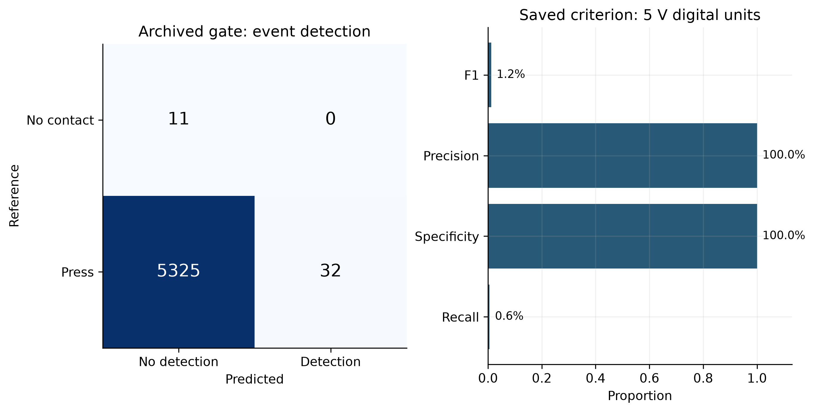

## 8. Temporal Characteristics

<!-- MODEL EVIDENCE START -->
The model report supplies a separate **computational timing** result: offline stateful inference took a median **41.10 ms** and 95th percentile **44.46 ms**. That measurement includes optical-tabular preprocessing, causal state, the three main tasks and an alternate contact policy. It excludes camera acquisition, decoding, pixel extraction and display. Contact/localization output smoothing in the saved causal models uses a 1-s time constant; that parameter is not a measured onset or recovery time. The runtime measurement supports software feasibility only and does not fill the intrinsic response-time or recovery-time entries. [Model report, Tables 21 and 23](model_report_review/evidence/Manual_Calibration_Models_Technical_Report.pdf).

<!-- MODEL EVIDENCE END -->

The median camera sample interval across recordings was **0.1301 s** (approximately 7.69 samples/s); the median raw force interval was 0.0919 s. The video container's nominal frame rate does not replace actual acquisition timestamps. Median force-defined pulse duration was 0.5490 s and the median number of camera samples per press was 4.

The recorded optical response passes through a narrow temporal magnification filter. Repeated manual loading often does not return to an unloaded plateau, and force and optical maxima may not align. Consequently intrinsic response time, 10–90% rise time and recovery time are **not quantitatively assessed**. `peak_time_difference_s` is preserved as a sampled force/optical peak offset, explicitly **not a response-time estimate**. Figure 7 illustrates actual force-defined pulses and optical sampling; it does not claim milliseconds of sensor latency. Unsynchronized photophysics or mechanical recovery cannot be separated from camera, filter and sampling effects with this protocol.

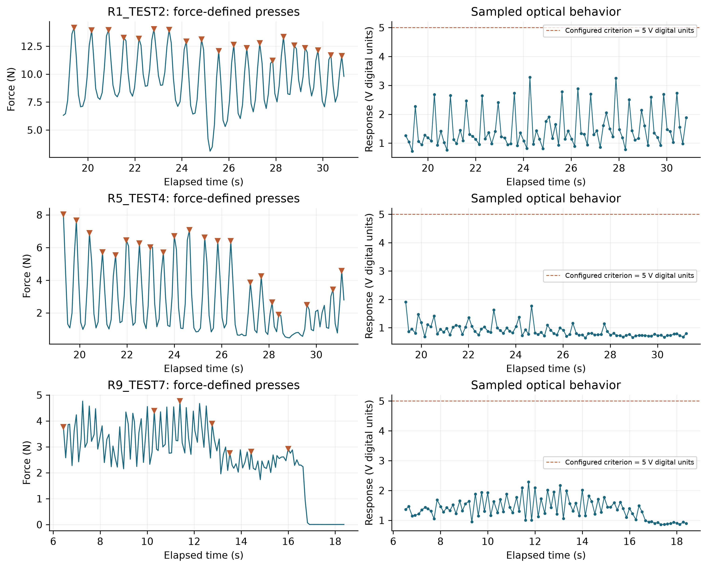

## 9. Hysteresis

**Hysteresis could not be quantitatively characterized from the available experimental protocol.** Force rises and falls during each finger press, but this alone does not establish comparable quasi-static loading and unloading trajectories. Uncontrolled rates, residual force, sparse optical samples and the 1.1–1.2 Hz optical filter confound any apparent loop with dynamic lag. A normalized loop area or maximum separation would therefore not identify intrinsic global sensor hysteresis. No automatic-calibration data were mixed into this manual-archive analysis.

## 10. Spatial Consistency

Taxel identity is retained only as a blocking/grouping factor. Recording-level mean global residuals differ across locations; these diagnose whether one pooled response remains representative. The range of location mean residuals is **-0.5814 to 0.4896 V**. The force-only linear model had R² 0.2229; adding baseline block gave 0.3438; adding both baseline block and taxel gave 0.5336. These comparisons include recording-held-out RMSE in the accompanying table and should not be interpreted from in-sample R² alone.

| model | parameters | force_coefficient_V_per_N | r2 | rmse | mae | recording_cv_rmse |
| --- | --- | --- | --- | --- | --- | --- |
| force_only | 2 | 0.12106 | 0.22292 | 0.70451 | 0.52771 | 0.71776 |
| force_and_baseline_block | 5 | 0.098713 | 0.3438 | 0.6474 | 0.45639 | 0.67273 |
| force_and_taxel | 10 | 0.11897 | 0.44952 | 0.59296 | 0.4165 | 0.66242 |
| force_baseline_and_taxel | 13 | 0.090627 | 0.53364 | 0.54578 | 0.38135 | 0.61022 |
| within_recording_centered_force | 73 | 0.082331 | 0.67039 | 0.45883 | 0.30833 | Not available |
| equal_recording_weight_linear | 2 | 0.11616 | 0.21385 | 0.70861 | 0.5202 | Not available |

The within-recording centered slope is 0.08233 V units/N, and equal recording weighting gives 0.11616 V units/N. Both are lower than the press-weighted pooled slope. Their missing cross-validation values are intentional: the first includes recording-specific intercepts unavailable for new recordings; the second is a weighting diagnostic. Their tabulated R²/RMSE are unweighted descriptive scores for comparability. The richer adjusted model improves recording-held-out RMSE to 0.6102 V, which shows that acquisition and location information materially explain response variation. A single pooled line should therefore be interpreted as an average under this experiment rather than spatially uniform calibration.

Location, trial order, force distribution and baseline/camera settings are incompletely crossed. Their contributions cannot be uniquely identified as physical taxel effects. No taxel is removed, sign-flipped, declared the best sensor or given a separate primary force-response curve. A random-effects variance decomposition would be poorly identified with one specimen and one acquisition session; the simpler fixed-block diagnostics expose the confounding without asserting generalization to a population of skins.

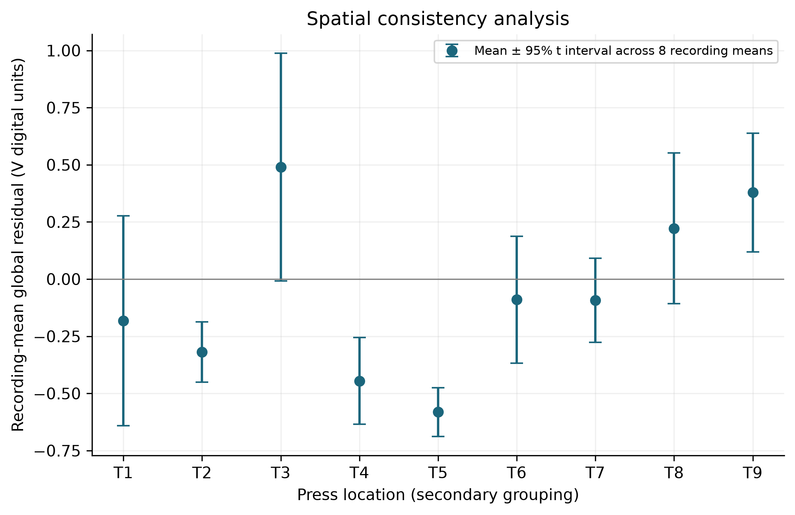

## 11. Localization Performance

<!-- MODEL EVIDENCE START -->
### Learned nine-region localization

Overall model-assisted BAURods localization accuracy was **84.40%**, with **macro F1 0.8475**, across 7,154 eligible held-out contact frames from 54 recordings. This describes nine discrete regions of one sensing skin. Requiring both successful learned contact detection and the correct region gave **83.61% joint accuracy** on the same eligible positive frames. It is not a millimetre spatial-resolution result. [Model report, Tables 10 and 19](model_report_review/evidence/Manual_Calibration_Models_Technical_Report.pdf).

The model therefore supplies evidence of useful region discrimination on held-out recordings. Spatial/generalization differences remain material: TEST1 accuracy was 42.71%, versus 87.43–97.87% for TEST2–TEST6, and ROI 2 recall was 56.00%. No group or location was removed to improve the headline. The earlier known-contact argmax accuracy of 94.31% comes from different features, press peaks, weighting, force coverage and recording inclusion; it cannot be presented as outperforming the learned model or averaged with its score.

### Archived gate and known-contact press diagnostics

<!-- MODEL EVIDENCE END -->

Localization is evaluated separately from force-response characterization. The predicted location is the archived software's dominant ROI at the event's greatest global response, with the saved **5-V gate** retained. A below-threshold output is an explicit **No detection** result and counts as failure to localize a known press.

Overall BAURods localization accuracy was **0.597%** (95% recording-bootstrap interval 0.195–1.089%). **Macro-averaged F1 was 0.01135** (95% interval 0.00367–0.01853). Macro precision was 0.44444 and macro recall was 0.00577. There were 5,325 no-detection outcomes. Conditional accuracy among detected presses was 100.00%, but its small and selected denominator prevents use as headline localization accuracy. For comparison, removing the optical gate and always choosing the largest ROI gave 94.31% location accuracy; this diagnostic is not the deployed rule's accuracy.

For a distinct **known-contact location-discrimination task**, ungated argmax gives macro precision 0.95221, macro recall 0.94447, and macro F1 **0.94437** over all 5,357 presses. This uses external knowledge that a press occurred and asks which ROI responded most strongly. It is an offline diagnostic, not thresholded autonomous localization. Its separate confusion matrix is in `figures/spatial_diagnostics/ungated_localization_diagnostic.png`. The difference between this diagnostic and end-to-end performance identifies the saved detection gate as a major limitation, without claiming that a replacement gate has been validated.

The confusion matrix includes the no-detection column and all nine target classes. Per-class precision/recall/F1 are supporting diagnostics in `localization_per_class.csv`, not independent sensor-characterization conclusions. The supplied technical report and saved outer predictions now support the separate frame-level learned-model results above. Those predictions have not been converted into a new press-level model score.

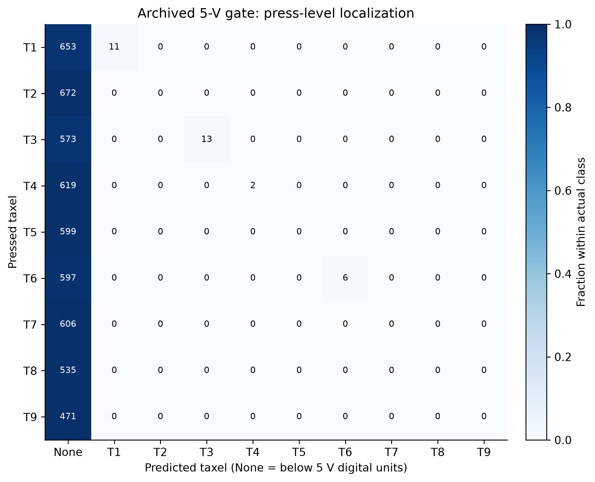

## 12. Characterization Summary

The combined evidence supports BAURods as an integrated 3 × 3 visuotactile skin with measurable force-associated optical response, useful spatial information and strong retrospective model-assisted contact discrimination. The clearest application result is 98.50% contact balanced accuracy, complemented by 84.40% nine-region localization accuracy and 83.61% joint contact-and-region accuracy within the specified frame evaluation. Force estimation improved to 0.499 N MAE but remains less mature, particularly for lighter contacts.

The physical press analysis and learned prediction study answer complementary questions. The first quantifies the recorded optical behavior across the tested skin; the second measures the usefulness of richer original-video features for inference on held-out recordings. Together they support the feasibility of computational interpretation of the sensing skin under the archived manual conditions. They do not isolate which modeling component caused each gain or establish prospective live-system performance. The low recall of the earlier 5-V gate remains visible as a limitation of that acquisition configuration.

The experiment supports tested force/response ranges, global descriptive statistics, a pooled response model, apparent slope, force-conditioned dispersion, sampled baseline statistics and separately scoped detection/localization results. Intrinsic force sensitivity, a validated linear operating interval, a reliable force detection limit, intrinsic response/recovery, hysteresis, saturation capacity, long-term drift and between-device reproducibility remain **not quantitatively assessed**. Neither the 0.05–3 N model interval nor the 23.3004 N observed press maximum establishes a validated operating limit.

### Reproducibility and evidence

`global_sensor_characterization.py` reads the source ZIP without modifying it. SHA-256: `e039dcd49f3390d34dc979490dcf46a6ecc43d9e6a2aec08e4952acc14b5006a`. The event table contains recording identity, force-sample row indices, start/peak/end timestamps, optical-peak row, pressed location, baseline block and all derived values. The source reconciliation table verifies exported maximum/sum arithmetic, prediction reconstruction, force-unit conversion and timing. `validation_results.json` records the executed independent arithmetic checks. `analysis_results.json`, CSV tables, PNG/PDF/SVG figures and the Excel export provide inspectable results. Source code and output hashes are recorded in `run_manifest.json`.

Method references: [SciPy peak prominence](https://docs.scipy.org/doc/scipy/reference/generated/scipy.signal.peak_prominences.html) defines the peak-separation statistic; [NIST calibration model validation](https://itl.nist.gov/div898/handbook/mpc/section3/mpc365.htm) motivates residual assessment beyond R²; [scikit-learn grouped cross-validation](https://scikit-learn.org/stable/modules/cross_validation.html) explains why observations sharing a group must stay together during validation. All numerical results above come from the supplied experimental data, not those references.

<!-- MODEL SOURCES START -->
The model extension is reproduced with `integrate_model_characterization.py`. It independently recomputes selected-model metrics and combined contact/region outputs from saved outer predictions, checks matched fixed/tuned frame IDs and truth, and confirms the manual archive hash. `model_report_validation.json` records the arithmetic checks and input hashes; `model_assisted_outer_predictions.csv` retains the evaluated predictions. Copied source tables and the supplied PDF are in `model_report_review/evidence/`. No models were retrained or installed into the GUI during this integration.
<!-- MODEL SOURCES END -->
