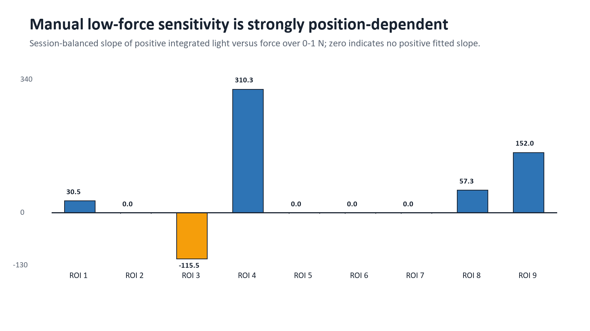
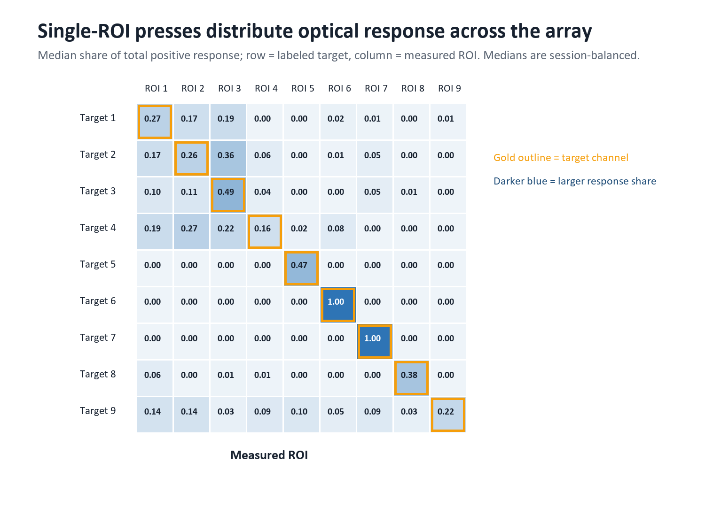
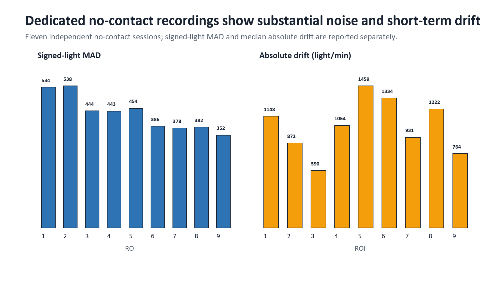
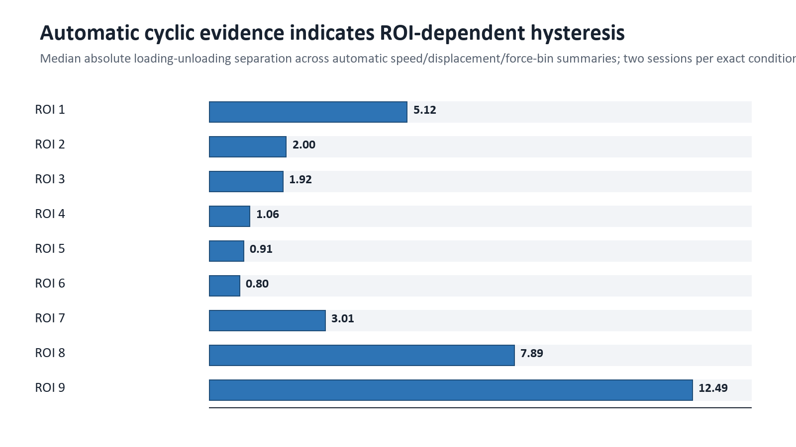
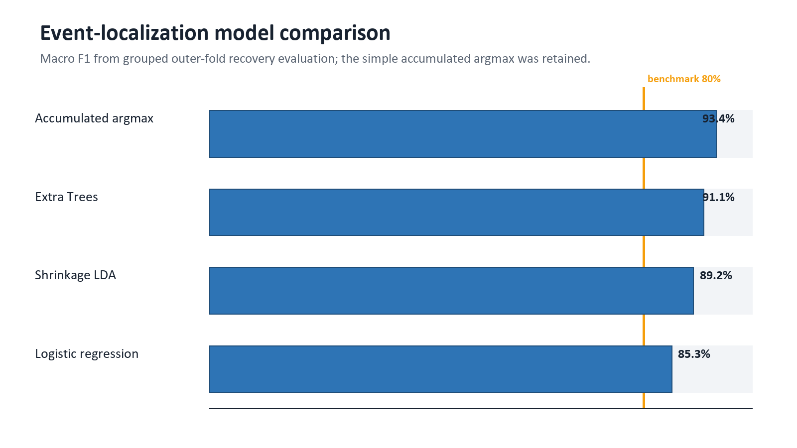
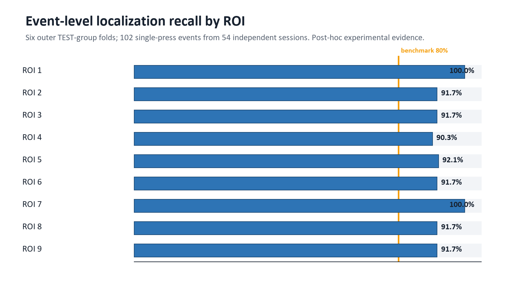
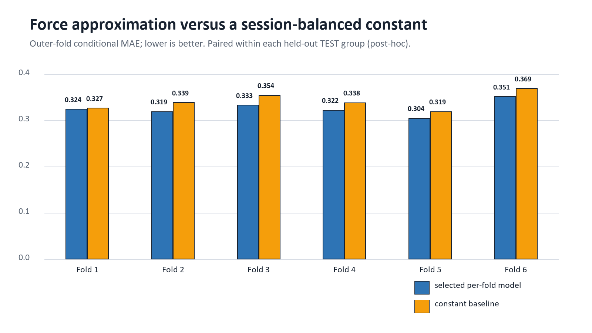
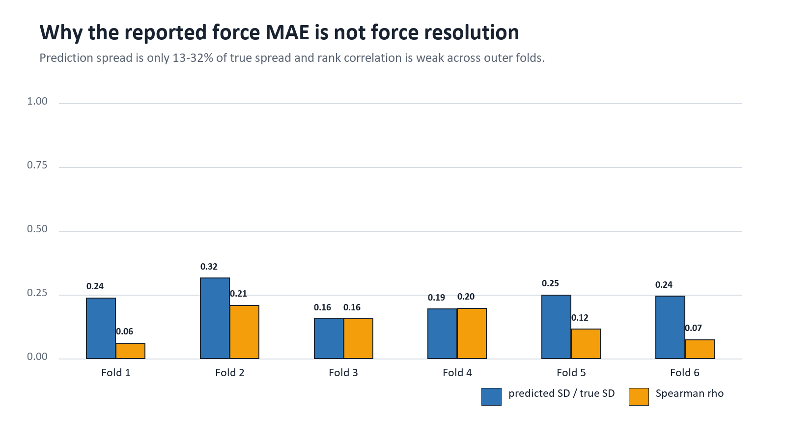
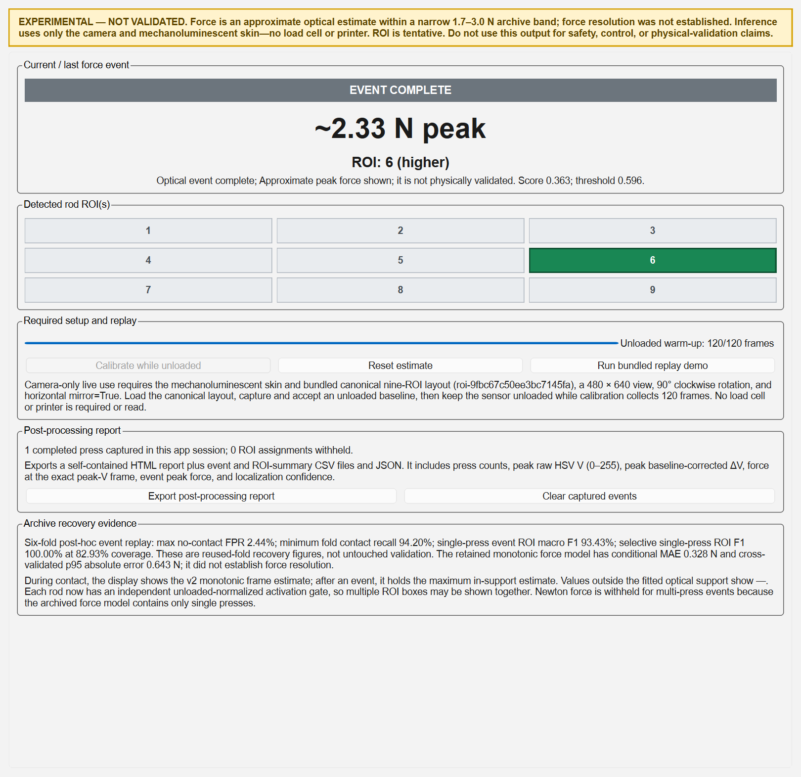

# SPARE Calibration Program and Camera-Only Force Sensing System

## Comprehensive Technical Development, Data, Modeling, Validation, Use, and Limitations Report

**Evidence cutoff:** 18 August 2026 (Asia/Taipei)

**Document status:** Technical evidence synthesis — share with explicit caveats.

## Technical Summary

> **Bottom line:** The project has a physically exercised, integrity-oriented Windows acquisition and calibration program; a strong retrospective camera-only event-localization result; and a deliberately limited approximate force output. The software and synchronized physical acquisition are verified more strongly than the force-estimation claim. The v4 model is experimental, post-hoc, device-specific, and not eligible for a validated or deployment-grade force-sensor claim.

The SPARE Camera and Load-Cell Calibration GUI is a standalone PySide6 application for collecting manual fixed-label presses or Ender 3-driven repeated presses from a nine-region sensing skin. It acquires unannotated camera frames, Arduino Nano/HX711 load-cell samples, and—when selected—independent Marlin printer motion. It performs per-pixel optical baseline correction, signed load-cell calibration, host-monotonic synchronization, structured export, graph generation, partial-file recovery, and optional live camera-only inference. [E01, E13-E22]

The strongest present model result is discrete event-level localization: 93.43% macro F1 and 93.41% accuracy on 102 single-press events from 54 independent manual sessions, using six complete TEST-group outer folds. Every ROI's reported event recall is at least 90.28%. A selective output reaches 100% macro F1 at 82.93% coverage. These are retrospective post-hoc recovery results because the same six outer TEST groups had already been inspected during prior model development. [E04, E27-E30]

The current force output is a 32-knot monotonic isotonic mapping from a filtered, normalized signed optical spatial-range score to an approximate force in a narrow nominal band of 1.7-3.0 N. The conditional MAE is 0.328 N and the cross-validated 95th-percentile absolute error is 0.643 N. Those headline errors do not establish force resolution: the model improves MAE over a session-balanced constant by only 0.013 N (3.81%) in the retained v2 mapping, the expanded per-fold search improves by 4.49%, mean Spearman rank correlation is only 0.207, and predicted spread is about 20.7% of true spread. Force is withheld outside fitted score support and when multiple rods are active. [E27-E30]

The immutable feature-store reconciliation is internally strong: 245 sessions and 179,176 decoded frames were recovered exactly, with zero missing or unmatched video frames and unchanged archive hashes. The manual archive contributes 83 sessions/29,318 frames; the automatic archive contributes 162 sessions/149,858 frames. Governance is asymmetric: the manual archive controls application modeling and all general characterization metrics; the automatic archive is prohibited from application-model preprocessing, fitting, thresholds, ranges, selection, and evaluation, and is allowed only for hysteresis and creep-related exploratory characterization. [E02-E05, E23-E26]

**Table 1. Present system and evidence status**

| Area | What is presently supported | Evidence status | Thesis-safe interpretation |
| --- | --- | --- | --- |
| Program acquisition/export | Camera, load cell, synchronized rows, optional printer state, videos, CSV/JSON/PNG | Implemented; physically exercised | A research acquisition/calibration platform |
| Load-cell calibration | Signed 200 g factor, tare, SNR/CV gates, ±5% verification | Physically verified on one fixture | Reference-force acquisition was demonstrated on the tested setup |
| Camera-only contact/event detection | Warm-up-calibrated event state with two-frame debounce | Post-hoc retrospective | Promising experimental detector; not prospectively confirmed |
| Discrete localization | Nine ROI classes; simultaneous-rod representation in runtime | Single-press post-hoc evidence | Strong discrete localization within this dataset; multi-press accuracy unknown |
| Force estimation | Approximate isotonic force inside optical support | Experimental; release blocked | Error-bounded approximation, not validated force measurement or resolution |
| Automatic repeated press | State machine, safety checks, exports, simulation and read-only printer checks | Software verified; full physical sequence pending | Automation infrastructure exists, but physical repeated-press safety/performance is incomplete |
| Sensor characterization | Sensitivity, nonlinearity, repeatability, cross-talk, noise/drift, SNR, hysteresis, lag proxies | Qualified by metric-specific boundaries | Characterization evidence must be reported with its individual protocol limitations |

*Source: Consolidated from [E01-E08, E23-E30].*

**Table 2. Headline quantitative evidence**

| Metric | Result | Population/grain | Qualification |
| --- | --- | --- | --- |
| Reconciled feature store | 245 sessions; 179,176 frames | Independent session; decoded frame | 0 missing and 0 unmatched video frames |
| Manual application corpus | 83 sessions; 29,318 frames | 54 primary + 11 no-contact + 18 replay | Only 54 primary sessions enter six TEST-group model folds |
| Event localization | Macro F1 93.43%; accuracy 93.41% | 102 events; 54 independent sessions | Post-hoc grouped outer-fold evidence |
| Selective localization | Macro F1 100%; coverage 82.93% | Eligible single-press events | Abstention trades coverage for accuracy |
| Contact detection | Minimum fold recall 94.20%; maximum no-contact frame FPR 2.44% | Held-out TEST group and dedicated no-contact frames | Post-hoc; zero false-contact episodes in this replay |
| Approximate force | Conditional MAE 0.328 N; p95 absolute error 0.643 N | 1.7-3.0 N; 4,622 frames/54 sessions in expanded benchmark | Not resolution; not untouched validation |
| Force tracking | Spearman rho 0.207; predicted/true SD ratio 0.207 | Six outer folds | Fails resolution/tracking gate |
| Physical camera | 14.985 frames/s over 60 s | 901 DirectShow frames | Nominal 30 FPS readback was not authoritative |
| Physical load cell | ~10.89 samples/s; 0.493% verification error | 661 samples/60 s; one 200 g verification | One tested fixture and placement |
| Current automated tests | 490 passed in isolated file groups | Current workspace on 18 Aug 2026 | Monolithic Windows Qt run can trigger pyqtgraph GC access violation |

*Source: Recomputed/reconciled from [E05-E07, E23-E30, E35] and validation_checks.json.*

## 1. Scope, Intended Use, and Evidence Hierarchy

### 1.1 Scope of this dossier

This report covers the complete project-owned calibration program and its evidence chain: intended purpose; hardware and software architecture; development chronology; operator workflow; camera, load-cell, and printer handling; raw and derived data; feature extraction; synchronization; immutable feature-store construction; characterization metrics; historical and current modeling; validation; limitations; thesis-safe claims; and reproducibility. Installed Arduino tooling, the local virtual environment, caches, and other third-party runtime files are not treated as project evidence except where a measured environment version affects reproducibility.

The report is descriptive and diagnostic. It reports what was implemented and measured, why certain model and governance decisions were made, and which claims remain unsupported. It does not infer causal material behavior from observational calibration archives and does not treat post-hoc cross-validation as prospective confirmation.

### 1.2 Evidence hierarchy

**Table 3. Evidence hierarchy used throughout this report**

| Level | Evidence type | Examples | Permitted use |
| --- | --- | --- | --- |
| A | Physical verification | Camera cadence, load-cell cadence/calibration, accepted synchronized session | Support statements about the tested hardware setup and acquisition path |
| B | Immutable reconciled data | Archive hashes/CRC, 245-session feature store, session-indexed tables | Support corpus identity, completeness, and auditable derivation |
| C | Frozen/qualified characterization | Manual-first metric tables and validation report | Support metric-specific sensor observations with stated protocol boundaries |
| D | Post-hoc experimental model evidence | v1-v4 recovery metrics and grouped folds | Support feasibility and retrospective performance only |
| E | Historical/superseded analyses | Earlier automatic/manual/global linear models | Explain development evolution; not current application performance |
| F | Planned/unperformed gates | Known-force live test, 60-minute soak, representative usability, physical multi-press | Identify remaining work; no positive claim |

*Source: Evidence-policy synthesis of [E02-E08, E23-E34].*

> **Controlling rule:** When records disagree because the software evolved, the most recent dated evidence governs current state; earlier counts and schemas are retained as historical checkpoints. When a model metric conflicts with a release decision, the release decision controls the claim.

### 1.3 Repository condition and traceability limitation

The local Git repository has no committed history and the project directories are presently untracked. Consequently, this dossier reconstructs chronology from dated plans, decision logs, validation reports, run manifests, hashes, and artifacts—not from commit history. File modification times are not treated as authoritative development dates. This is a material traceability limitation for a thesis methods audit and should be corrected before future development by committing code, configuration, and decision records with tagged releases.

## 2. System Objective, Boundaries, and Terminology

### 2.1 Research objective

The program was built to acquire paired optical and mechanical-reference observations from a nine-location sensing skin, first to calibrate and characterize the device and then to explore whether a camera-only runtime could detect contact, localize the active region, and approximate force. The calibration GUI is therefore both an acquisition instrument and an experimental application host. Those roles must remain distinct: the load cell supplies offline reference labels and calibration evidence, whereas the deployed v4 inference path accepts camera-derived ROI features only.

### 2.2 System boundary

**Table 4. System inputs, internal products, and outputs**

| Boundary element | Content | Role |
| --- | --- | --- |
| Physical inputs | Arducam IMX179 frames; Nano/HX711 counts; optional Ender 3 position/commands; operator trial labels | Acquisition |
| Calibration state | Nine-ROI layout, unloaded per-pixel V baseline, signed counts/g factor, tare, verification record | Required context |
| Frame-level derived data | HSV statistics, signed/positive delta-V features, active fractions, centroids, legacy localization, synchronized force | Analysis/export |
| Characterization products | Sensitivity, nonlinearity, repeatability, cross-talk, noise/drift, SNR/detection, hysteresis, lag and NEF proxies | Sensor evidence |
| Experimental live inference | Contact/event state, one or more ROI labels, optical threshold ratio, optional approximate force | Camera-only runtime |
| Final artifacts | Original/auxiliary videos; CSV/JSON; PNG graphs; status/logs; model reports | Reproducibility and review |

*Source: [E01, E09, E13-E22].*

### 2.3 Key terminology

- ROI means one of nine fixed rectangular regions in a 3×3 row-major layout. Localization is classification to these discrete regions, not continuous millimetre localization.
- Reference force means load-cell-derived force after signed calibration, tare, and synchronization. It is not a live input to the camera-only v4 model.
- Positive light means the sum or mean of max(current V − baseline median V, 0). Signed light retains darkening as negative values.
- Contact detection is the binary/state decision that an optical event is active. Event localization assigns the event to one or more ROI identities.
- Approximate force is the v4 isotonic output inside fitted optical-score support. It is not equivalent to validated measurement, sensor resolution, or certified force.
- Session is the independent acquisition unit. Frames and repeated cycles inside a session are repeated observations, not independent replicates.

## 3. Development History and Decision Record

Because the repository lacks commit history, the following chronology is reconstructed from dated project records and immutable run manifests. It explains how an acquisition program expanded into printer automation, formal characterization, and a disclosed experimental live sensor.

**Table 5. Reconstructed development chronology**

| Date | Development or decision | Technical consequence |
| --- | --- | --- |
| Before 3 Aug 2026 | Core GUI, simulation, baseline, load-cell calibration, synchronization, recorder, graph export, and engineering reviews implemented | Architecture emphasized single hardware owners, bounded queues, exact schemas, partial artifacts, and fail-closed readiness |
| 3 Aug 2026 | Arducam/Nano/HX711 physical validation | DirectShow retained at measured 14.985 FPS; ~10.89 Hz load-cell stream; 200 g calibration and one accepted synchronized session demonstrated |
| 4 Aug 2026 | Ender 3 repeated-press software integration | Independent printer serial owner, motion state machine, press-zero semantics, bounds, force limit, logging, and simulation exports added |
| 6-8 Aug 2026 | Automatic and manual calibration archives collected | 162 automatic sessions plus 83 manual sessions; later governed as different evidence roles |
| 13 Aug 2026 | Application modeling and characterization formally separated | Automatic archive forbidden for application model; manual-first characterization and immutable feature store frozen |
| 13 Aug 2026 | Authoritative preprocessing/range gate failed | No confirmatory candidate comparison was eligible under the original plan |
| 13-16 Aug 2026 | Disclosed recovery v1-v3 | v1 restored retrospective metrics; v2 fixed runtime parity and exposed failed force-resolution behavior; v3 emphasized event signal and withheld Newton force |
| 17 Aug 2026 | Hybrid v4 assembled | v3 event detection/localization combined with v2 isotonic approximate force; expanded family comparison did not justify replacement |
| 18 Aug 2026 | Current audit | 490 tests pass in isolated file groups; exact schema now contains 812 scoped data-dictionary rows; validated release remains blocked |

*Source: [E04-E08, E23-E30, E35].*

### 3.1 Why the original application plan stopped

The original plan required a training-only contact threshold that simultaneously achieved at least 90% contact recall and no more than 5% no-contact false-positive rate, plus a common all-ROI force interval supported by session counts and monotonic-response rules. The frozen manual-only gate failed before confirmatory model comparison: the best development recall under the no-contact constraint was 85.16%; several required low-force bins were absent; ROI 5 had a nonpositive initial slope; and ROI 7's supported interval ended near 0.5625 N. The correct governance response was to stop the confirmatory path rather than optimize through the held-out data. [E02, E04]

### 3.2 Recovery models and permanent disclosure

Because additional data could not be collected, later work was explicitly labeled post-hoc recovery. v1 used a nine-frame signed-light spatial-range signal, unloaded quantiles, isotonic force, and active-fraction argmax. v2 replayed complete sequences with contact debounce, two-frame ROI switching, and a selective confidence threshold; its strong MAE coexisted with weak force variation tracking. v3 therefore made a unitless event signal the primary output and removed Newton force. v4 restored the v2 approximate force alongside the stronger v3 event/localization path, while retaining the release blockers in machine-readable form. No recovery version can become untouched confirmation evidence without a new prospectively frozen dataset. [E04, E12, E27-E30]

## 4. Hardware and Software Architecture

### 4.1 Tested hardware configuration

**Table 6. Hardware components and tested identities**

| Component | Tested identity/configuration | Interface | Status |
| --- | --- | --- | --- |
| Camera | Arducam IMX179 Camera Module; VID:PID 1BCF:0B12 | USB/OpenCV DirectShow, index 0 | Physically verified |
| Load-cell controller | Arduino Nano / CH340; VID:PID 1A86:7523 | COM3, 115200 baud | Physically verified |
| ADC/load cell | HX711 on Nano D4/D5; fixture-aware 200 g calibration | Fresh-conversion ASCII DATA rows | Physically verified on one fixture |
| Motion platform | Creality Ender 3 V2 Neo; Marlin 1.1.6; EMERGENCY_PARSER:0 | Independent COM4, 115200 baud | Read-only and small manual moves verified; repeated press not physically validated |
| Host | Windows 10.0.26200 / Windows 11 build string in later analysis manifests | PySide6 application | Project environment |

*Source: [E06, E07, E23].*

### 4.2 Layered software design

**Table 7. Project-owned software layers**

| Layer/path | Primary responsibilities | Important design properties |
| --- | --- | --- |
| app.py | Application entry point and simulation switch | Launches one desktop process |
| core/ | Configuration models, lifecycle/readiness, logging, model-bundle contracts, live inference | Dataclasses, explicit validity, state transitions, hash/schema checks |
| services/ | Camera, load-cell serial, printer serial, repeated-press controller, Qt workers, simulation, recorder | One hardware owner per device; bounded queues; generation IDs reject stale callbacks |
| processing/ | Orientation, ROI, baseline, HSV features, motion magnification, legacy localization, load-cell calibration, synchronization | Deterministic non-Qt functions shared by physical and simulation paths |
| data/ | Canonical schemas, incremental CSV writers, synchronized finalization, graph export | Exact column order, missing-value rules, atomic publication |
| gui/ | Nine workflow tabs, dual video, controls, plots, readiness, logs | Newest-only preview buffer is independent of analytical/recording queues |
| arduino/ | HX711 firmware | Reads only when ready; emits one ID/timestamp/raw value per fresh conversion |
| scripts/ and analysis_outputs/ | Dataset construction, characterization, modeling, replay, performance and audit | Run manifests, hashes, grouped validation, immutable outputs |
| tests/ | Hardware-free unit, integration, simulation, GUI-offscreen, contract and reliability tests | 490 pass when isolated in current audit |

*Source: [E01, E08, E13-E22, E35].*

### 4.3 Concurrency and ownership

Camera acquisition, optical analysis, motion magnification, serial load-cell acquisition, printer control, recording, and graph export operate through separate owners/workers. Preview uses a newest-only buffer so a slow UI does not back up the camera. Recording uses a bounded loss-detecting queue, while graph writes are asynchronous. The load-cell COM port and printer COM port are intentionally independent. Hardware callbacks carry transaction/generation identities so callbacks from a cancelled or superseded operation cannot mutate current state. [E08, E21]

### 4.4 Fail-closed scientific states

The live path defines STARTUP, SETUP_BLOCKED, BASELINE_CAPTURING, READY, LIVE_NO_CONTACT, LIVE_CONTACT, LIVE_UNCERTAIN, LIVE_LIMIT, PAUSED, RECONNECTING, and ERROR transitions. Exact localization is permitted only in contact state; incompatible layout, missing baseline, stale/non-finite features, out-of-support force scores, or model-bundle integrity errors withhold output. The experimental bundle loader enforces an allowlist, regular-file and size constraints, per-file SHA-256, a complete SHA256SUMS list, monotonic force knots, the exact feature order, and the explicit experimental release decision. [E18, E19, E28-E30]

## 5. Installation, Setup, and Operator Use Process

### 5.1 Software installation and launch

1. Install 64-bit Python 3.11 or later on Windows and create a virtual environment with `py -3.11 -m venv .venv`.
2. Install dependencies with `.\.venv\Scripts\python.exe -m pip install -r requirements.txt` and verify them with `python -m pip check`.
3. Launch hardware mode with `.\.venv\Scripts\python.exe app.py`, or launch clearly labeled simulation mode with `.\.venv\Scripts\python.exe app.py --simulation`.
4. Use the Windows helpers `setup_windows.bat` and `run_windows.bat` when a guided batch workflow is preferred.

The current GUI exposes Camera View; ROI and Baseline Settings; Image and HSV Processing; Motion Magnification; Load Cell and Calibration; Recording and Synchronization; Printer Motion; Graph and Export Settings; and System Status and Logs. The original display is an unannotated copy. ROI overlays and processed views are separate display/output copies and do not alter the authoritative original frame. [E01]

### 5.2 Arduino/HX711 setup

1. Install an HX711 Arduino library exposing `begin()`, `is_ready()`, and `read()`; open `arduino/hx711_nano_stream/hx711_nano_stream.ino`.
2. With USB power disconnected, wire HX711 DOUT to Nano D4, SCK to D5, module-rated VCC, and common GND. Connect the load cell to E+/E− and A+/A− according to its datasheet; wire color is not standardized.
3. Upload for Arduino Nano, select the correct processor/bootloader and COM port, then close Arduino Serial Monitor before GUI connection.
4. Select the same port at 115200 baud in the GUI. A physical connection is accepted only after finite numeric readings arrive; HELLO identity alone is insufficient.

The supplied firmware streams immediately. The canonical line is `DATA,sample_id,arduino_micros,raw_adc`; optional commands are PING, START, STOP, and STATUS. The host also supports plain numeric and several compatibility formats. The firmware calls `read()` only after `is_ready()`, preventing stale cached conversions from being re-emitted. Midstream HELLO/sample-ID/micros resets create a new device-session identity without resetting the host trial clock. [E01, E22]

### 5.3 Camera setup and orientation

1. Connect the Arducam, refresh camera indices, and confirm the device through preview and Windows Device Manager; an index alone is not identity evidence.
2. Use DirectShow first on the verified unit. Connect, confirm dimensions and cadence, and open the native Windows camera properties dialog on the active capture handle when exposure/focus/white balance/gain need adjustment.
3. Apply software rotation first and optional horizontal mirroring second. Any change invalidates the optical baseline and may swap the ROI frame dimensions.
4. Treat measured capture cadence as authoritative. The tested DirectShow stream was about 14.985 FPS despite a nominal 30 FPS property.

### 5.4 Nine-ROI definition and unloaded baseline

1. Define exactly nine non-overlapping, in-bounds rectangles in row-major order and save the layout if it will be reused.
2. Ensure the sensing skin is unloaded and camera settings are stable. Allow the normal camera warm-up.
3. Capture a baseline for the configured duration (default 3 s) with at least 20 valid frames.
4. Review and accept the baseline. The record binds camera device/backend/resolution/settings, processing settings, orientation, and ROI-layout identity.
5. Before recording, perform the unloaded drift check. The default acceptance criterion is mean absolute difference across the nine ROI mean-V values no greater than 5 V levels.

For each ROI, baseline capture converts every BGR frame to HSV and stores a per-pixel median V image plus a per-pixel mean V image and ROI-level H/S/V summaries. Any camera, orientation, processing, or ROI-layout change invalidates the record. [E09, E14]

### 5.5 Signed 200 g load-cell calibration

1. Collect an unloaded raw-count window and a loaded window using the configured known mass (default 200 g). Each normally requires at least 20 samples; 10 is a documented fallback only when measured cadence cannot supply 20 in the window.
2. Compute the signed factor `(loaded mean − unloaded mean) / known mass`. The sign is retained so either electrical polarity produces a positive force when the same loading direction is applied.
3. Accept only if calibration SNR is at least 10, the loaded-window force CV is at most 2%, and the span is numerically nonzero.
4. Tare with a stable unloaded window; the default maximum raw standard deviation is 100 counts.
5. Reapply the known mass and require verification error no greater than ±5%. Persist calibration identity, device/firmware/port provenance, windows, tare, and verification.

### 5.6 Manual recording workflow

1. Enter trial ID, sensing-skin ID, target ROI ground truth, optional specimen/participant ID, optional interaction/force class, press number, and notes. These are fixed trial labels, not frame-level contact labels.
2. Choose a new writable output root. The preflight checks path identity, writeability, free space, and non-overwrite behavior.
3. Confirm camera, exact ROI layout, accepted baseline, current drift, load-cell connection/calibration/verification, labels, output destination, and recorder/worker readiness.
4. Select the original video (required) and any optional overlay, processed, or motion-magnified streams. The authoritative quantitative source remains unannotated oriented pixels for the live application model.
5. Start recording, perform the single intended press, stop recording, and review the generated integrity/status summary and plots.

### 5.7 Repeated-press workflow

Printer setup begins with M115 identity, explicit G28 homing, M114 position readback, and bounds checks. Press Zero is stored in host memory and must never be implemented by G92. The target Z is `press_zero_z_mm + signed_displacement_mm`; on the tested machine, negative displacement moves downward toward the specimen. A sequence proceeds through pre-roll, down motion, hold, up motion, inter-cycle dwell, repeated cycles, and post-roll. Command lifecycle, reported position, phase, cycle identity, and force-safety state are exported with frame and load-cell rows. [E01, E07]

> **Safety boundary:** The force limit is a secondary software safeguard that can issue M410 when calibrated force exceeds a threshold. The tested Marlin firmware reports EMERGENCY_PARSER:0, and physical abort latency and a full repeated-press sequence were not validated. The program is not a certified machine-safety interlock; operator supervision, conservative motion bounds, mechanical clearance, and an accessible power-off path remain mandatory.

## 6. Acquisition, Recording, and Exported Data

### 6.1 Authoritative clocks and identities

Every accepted frame receives a permanent zero-based capture_frame_id, a host_monotonic_ns timestamp captured at acquisition, elapsed time relative to the recording start, and a human-readable wall clock. Every fresh HX711 conversion carries an Arduino sample ID, raw 32-bit micros timestamp, unwrapped micros value, host receipt monotonic timestamp, and a device-session identity. Host monotonic time is the authoritative cross-device clock because the camera and Arduino do not share a trigger. [E16, E20-E22]

### 6.2 Incremental recording and integrity

The recorder writes `.partial` CSV/video artifacts incrementally and flushes by time and row count. Finalization is transactional: the recorder closes streams, validates exact schemas and row identities, synchronizes frames to load-cell samples, confirms video/frame/feature counts, writes status and metadata, and atomically publishes final names. If interrupted, partial recovery is fail-closed and reports why a session cannot be accepted. Original frames are never dropped silently; analytical failure produces a row with preserved identity/geometry, NaN derived values, and an error code. [E20, E21]

### 6.3 Standard session artifact set

**Table 8. Session files and scientific purpose**

| Artifact | Content | Authority/notes |
| --- | --- | --- |
| session_video.* | Unannotated oriented original frames | Only quantitative image source used by the immutable feature-store builder |
| auxiliary videos | Optional ROI overlay, processed view, motion-magnified stream | Visualization/review only unless an explicitly separate analysis declares otherwise |
| frame_features.csv | One row per accepted frame; camera/ROI/feature/localization/provenance fields | Current exact width: 366 columns |
| loadcell_raw.csv | One row per parsed physical sample; raw, calibrated, device-session, and motion fields | Current exact width: 46 columns |
| master_synchronized.csv | Frame row plus synchronized load-cell fields | Current exact width: 385 columns |
| data_dictionary.csv | Artifact-scoped column definitions, units, types, value roles, missing behavior | Current generated width: 812 dictionary rows across five schema scopes |
| session_config / camera / ROI / calibration / baseline files | Acquisition context and immutable identifiers | Required for provenance and replay |
| session_status and logs | Completion/abort, counts, errors, performance, identity checks | Acceptance evidence |
| spatial_graphs and graph companions | Heatmap, temporal line, and spatial-profile PNG/CSV/JSON bundles | Graph JSON controls metric meaning and units |
| printer_sequence files | Commands, responses, cycle/phase events, position, safety status | Present only for automated sequences |

*Source: [E01, E20, E21] and current_schema_dictionary.csv.*

### 6.4 Current schema groups

**Table 9. Current canonical schema composition**

| Group | Representative fields | Scientific role |
| --- | --- | --- |
| Trial/session | session_id, trial_id, skin/specimen ID, target ROI, optional classes/notes | Ground truth and metadata fixed at trial grain |
| Frame identity | capture_frame_id, monotonic/wall clocks, dimensions/FPS/backend, driver readbacks | Raw identity and camera provenance |
| Motion provenance | sequence/cycle/phase/command, zero/targets/positions, force-limit flags | Automated-sequence context |
| Load-cell synchronization | nearest sample, interpolated raw, force, method/gap/offset/validity | Frame-aligned mechanical reference |
| Per-ROI optical | 33 fields × 9 ROI: geometry, raw HSV, signed and positive delta, activity, centroids, normalized intensity | Raw-derived optical features |
| Legacy localization | dominant ROI, top ratios, weighted coordinates, confidence | Frame-level deterministic diagnostic |
| Validity/provenance | frame/baseline/load-cell validity, error, versions, calibration/baseline/layout IDs | Fail-closed interpretation and reproducibility |

*Source: [E20] and current_schema_dictionary.csv.*

Earlier implementation reports cite 647, 734, or other data-dictionary row counts. Those values were correct at their dated checkpoints. The current code generates 812 artifact-scoped rows because later versions added printer-motion fields, richer optical signed features, graph-companion scopes, and artifact-specific definitions for same-named fields. The complete current dictionary is delivered beside this report rather than reproduced as an 812-row appendix.

## 7. Optical, Mechanical, and Synchronization Processing

### 7.1 Canonical image transform and ROI geometry

The authoritative live layout expects raw 640×480 input, then a 90° clockwise rotation followed by horizontal mirroring, producing a 480×640 analytical frame. Its fixed identity is `roi-9fbc67c50ee3bc7145fa`. Saved 480×640 originals are not transformed a second time. A raw 640×480 input is transformed exactly once. Any orientation/layout mismatch blocks the live bundle. [E02, E19, E23]

**Table 10. Canonical live ROI rectangles on the 480×640 oriented frame**

| ROI | x | y | width | height | area (px²) |
| --- | --- | --- | --- | --- | --- |
| 1 | 98 | 161 | 82 | 89 | 7298 |
| 2 | 197 | 156 | 76 | 99 | 7524 |
| 3 | 312 | 154 | 58 | 97 | 5626 |
| 4 | 100 | 268 | 73 | 89 | 6497 |
| 5 | 204 | 264 | 76 | 96 | 7296 |
| 6 | 314 | 260 | 66 | 94 | 6204 |
| 7 | 104 | 383 | 73 | 77 | 5621 |
| 8 | 194 | 394 | 87 | 66 | 5742 |
| 9 | 312 | 379 | 61 | 77 | 4697 |

*Source: [E02, E19].*

### 7.2 Per-pixel optical baseline and feature formulas

For every frame, unannotated BGR is converted to OpenCV HSV exactly once. Within each ROI, the saved per-pixel baseline median V is subtracted in signed 16-bit arithmetic: `signed_delta(x,y,t) = V(x,y,t) − median_baseline_V(x,y)`. The positive response is `positive_delta = max(signed_delta, 0)`. The implementation preserves both signed and positive summaries because darkening contains information even though legacy light-only features clip it. [E13, E14]

**Table 11. Per-ROI optical feature families**

| Family | Fields/formula | Use |
| --- | --- | --- |
| Raw HSV | circular mean H above saturation gate; mean S; mean/median/max/p95/std V | Camera/material state and saturation review |
| Signed response | sum, mean, median, MAD of current V − baseline median V | Primary v4 contact/force input uses signed sum |
| Positive response | mean, max, p95, sum, sum/area, std of max(delta,0) | Characterization and legacy localization |
| Active pixels | count and fraction where positive delta ≥ configured threshold (default 10 V) | v4 localization and independent rod gates |
| Spatial centroid | positive-delta weighted local and full-frame x/y | Spatial diagnostic |
| Normalized intensity | ROI mean positive delta divided by sum over nine ROIs | Legacy deterministic localization |

*Source: [E09, E13, E20].*

### 7.3 Legacy frame-level deterministic localization

The general processing pipeline computes a legacy diagnostic localization from the nine ROI mean positive delta-V values. The ROI with the largest mean is returned only if it reaches the configured minimum (default 5 V). Confidence is dominant/total, with additional top-one/top-two ratio and intensity-weighted full-frame coordinates. Non-finite features make the result unavailable; invalid values are not silently replaced by zero. This legacy diagnostic is not the v4 event-localization model. [E13]

### 7.4 Load-cell equations

Let U be the unloaded raw mean, L the loaded raw mean, and M the known mass in grams. The signed factor is `c = (L − U)/M` counts/g. With tare T and raw sample R, `force_gf = (R − T)/c` and `force_N = force_gf × 0.00980665`. Calibration SNR is `|L − U| / max(population_std_unloaded, population_std_loaded)`. Loaded-window CV is the population standard deviation of converted loaded grams-force divided by its absolute mean, times 100%. Verification is the absolute mean-force error divided by expected grams-force, times 100%. [E15]

### 7.5 Online frame/load-cell synchronization

A frame is first matched to an exact host-monotonic sample if available. Otherwise, linear interpolation is used only when two samples bracket the frame, both gaps are within the configured maximum (default 200 ms), the device-session identity is unchanged, and timestamps increase. If interpolation is unavailable, the nearest sample is used only within the same maximum gap; ties prefer the earlier physical sample. When no valid match exists, force fields are NaN and synchronization_valid is false, but the frame row is retained. Contact state is derived from synchronized force using the configured 0.05 N threshold, never from trial labels. [E09, E16]

### 7.6 Offline model-label alignment

Model fitting uses a separate session-safe alignment contract. Positive lag pairs an optical observation at time t with reference force at `t − lag`. Reference timestamps are reduced by median when duplicated, interpolation never crosses sessions, no extrapolation is allowed, and a bracketing gap above 300 ms produces a missing label. The six outer-fold lags were 260, 220, 240, 240, 240, and 240 ms; the all-development value was 240 ms. These lags are preprocessing hyperparameters fitted within training partitions, not intrinsic material response times. [E11, E17, E27]

### 7.7 Motion magnification

Eulerian color/intensity motion magnification is optional and off by default. It executes in an independent drop-stale worker and may feed visualization or explicitly requested auxiliary streams. For the authoritative live application model, quantitative features come from the original unannotated oriented frame; the load cell and printer are forbidden runtime inputs, and motion-magnified output is not substituted into the v4 camera feature contract. [E01, E02]

## 8. Data Sources, Extraction, Reconciliation, and Governance

### 8.1 Source archives and permitted roles

**Table 12. Immutable archive inventory**

| Archive | Size / identity | Sessions / frames | Permitted role |
| --- | --- | --- | --- |
| Manual Calibration (2).zip | 1.20 GiB; SHA-256 e039dcd49f3390d34dc979490dcf46a6ecc43d9e6a2aec08e4952acc14b5006a | 83 sessions; 29,318 frames | Only application-model archive; controlling source for all general characterization metrics |
| Auto Calibration.zip | 29.03 GiB; SHA-256 f81a41b635aa2b893e9fa1faff0bda2db41ad0717d8c134fb6d907e1471e344d | 162 sessions; 149,858 frames | Characterization only: hysteresis and creep-related exploratory analysis |

*Source: [E03, E23-E25]. Full hashes are retained to prevent archive substitution.*

### 8.2 Manual archive design

**Table 13. Manual archive roles**

| Role | Sessions | Design | Use |
| --- | --- | --- | --- |
| Primary model/characterization | 54 | Six complete TEST sessions for each ROI 1-9 | Outer-fold application modeling and general press characterization |
| Dedicated no-contact | 11 | Short unloaded sessions; all nine ROIs observed | No-contact false positives, noise, drift, threshold evidence |
| Replay-only | 18 | TEST1_v2 and other recovery/replay sessions | Runtime behavior and combined independent ROI gate; not primary fitting |
| Total | 83 | 29,318 frames | Immutable manual corpus |

*Source: [E02-E05, E23-E26].*

The confirmatory-style split is six outer folds, each holding out one complete TEST number across all nine ROI. Every preprocessing choice—including no-contact floor, scale, lag, contact threshold, support/range, selective threshold, and model hyperparameters—must be fitted within the outer training partition. Session is the independence grain. This structure prevents frame leakage across folds, but the subsequent recovery work remains post-hoc because the outer-fold results had already been inspected. [E02, E04, E27]

### 8.3 Automatic archive design

The automatic archive contains 18 sessions per ROI: three absolute displacements (1.75, 2.625, and 3.5 mm) × three speeds (200, 400, and 600 mm/min) × one nominal 20-cycle session and one nominal 10-cycle session. Thus each exact ROI × displacement × speed condition has two independent sessions, collected across two days. Cycles are nested repeated observations inside session and must not be counted as independent replicates. [E03, E24-E26]

> **Automatic-data firewall:** Automatic sessions cannot supply application-model preprocessing, training labels, thresholds, support/range, model selection, or evaluation. They may support hysteresis, speed-stratified hysteresis, internal cycle QA, short fixed-displacement settling, and unloaded-recovery observations only. This firewall is enforced in configuration/tests and is a central thesis-methods requirement.

### 8.4 Feature-store extraction

1. Audit each ZIP archive by expected SHA-256, entry count, session count, and full member CRC.
2. For each session, read only the authoritative session_video original stream for quantitative pixels; do not read overlays, processed video, or motion-magnified video.
3. Reconcile every decoded frame to saved frame/master rows and exact session identity. Preserve reason-coded differences instead of silently dropping rows.
4. Apply the canonical orientation exactly once; saved 480×640 originals are not reoriented again.
5. Extract the fixed manual-only feature specification and retain raw/reference/corrected values, validity, phase, labels, layout, calibration, baseline, and source hashes.
6. For automatic sessions only, calculate a cycle-local force correction from the median synchronized unloaded dwell immediately before each cycle while preserving raw force.
7. Write one Parquet file per session, a session index, event log, reconciliation report, and run manifest. Do not store global fitted floors, scales, thresholds, Fdetect, Fmax, imputation, or model transforms in the immutable store.

**Table 14. Feature-store reconciliation checks**

| Check | Result |
| --- | --- |
| Archive hashes before vs. after | Unchanged for manual and automatic archives |
| Sessions checkpointed | 245 of 245 |
| Rows/decoded frames | 179,176 of 179,176 |
| Missing video frames | 0 |
| Unmatched video frames | 0 |
| Canonical layout only | Passed |
| Frame differences reason-coded | Passed |
| Global fitted values absent | Passed |
| Build time/environment | 82.51 s; CPython 3.12.13; NumPy 2.5.1; pandas 3.0.5; OpenCV 4.14.0.94 |

*Source: [E23].*

### 8.5 Data-quality findings

The authoritative feature-store and characterization products pass their own integrity/validation gates, but data quality is not equivalent to claim validity. The main risks are design limitations: only six primary sessions per ROI; exactly two independent automatic sessions per exact cyclic condition; two automatic collection days; short no-contact durations; zero labeled simultaneous-press events; narrow force recovery support; and no untouched confirmation set after model recovery. Four automatic sessions contribute one fewer usable cycle than nominal to cycle-bin summaries; this is disclosed and does not invalidate the session-level archive. [E24, E25]

## 9. Sensor Characterization Results

Characterization is governed metric by metric. Manual sessions control every general sensor-property claim. Automatic sessions contribute only conditional hysteresis and creep-related exploratory evidence. The validated characterization report classifies the package as ready to share with stated qualification boundaries, not as a universal device specification. [E03, E24-E26]

**Table 15. Characterization metric-status inventory**

| Status | Metrics |
| --- | --- |
| Primary | Archive integrity/reconciliation; low-force and local sensitivity; nonlinearity; between-session repeatability; spatial uniformity; cross-talk; no-contact noise/drift |
| Conditional-qualified | Plateau observations; SNR/detection; hysteresis; hysteresis cycle/correction QA; noise-equivalent-force proxy |
| Exploratory-insufficient | Short fixed-displacement settling/recovery; approximate standalone system lag |
| Not established | Historical combined common range/monotonicity; true creep; true force resolution |

*Source: metric_status.csv [E26].*

### 9.1 Static response, sensitivity, and nonlinearity

**Figure 1. Manual session-balanced low-force sensitivity by ROI**

*Source: manual_sensitivity_nonlinearity.csv [E26]. Values are characterization slopes, not the v4 force-model coefficient.*

**Table 16. Manual low-force sensitivity and observed nonlinearity**

| ROI | Integrated light/N | Light/pixel/N | Nonlinearity | Slope interpretation |
| --- | --- | --- | --- | --- |
| 1 | 30.475 | 0.00418 | — | positive |
| 2 | 0.000 | 0.00000 | — | zero/negative |
| 3 | -115.464 | -0.02052 | — | zero/negative |
| 4 | 310.256 | 0.04775 | — | positive |
| 5 | 0.000 | 0.00000 | — | zero/negative |
| 6 | 0.000 | 0.00000 | — | zero/negative |
| 7 | 0.000 | 0.00000 | — | zero/negative |
| 8 | 57.297 | 0.00998 | — | positive |
| 9 | 151.976 | 0.03236 | — | positive |

*Source: manual_sensitivity_nonlinearity.csv [E26]. Nonlinearity is reported only where the fitted slope supports the calculation.*

Only ROIs 1, 4, 8, and 9 show positive low-force slopes under the frozen rule; ROI 3 is negative and ROIs 2, 5, 6, and 7 are zero after the positive-slope qualification logic. Where nonlinearity is calculable, maximum deviation spans roughly 37.7-70.1% of the observed light range. This strong spatial heterogeneity blocks a single uniform optical-force calibration and helps explain why global force models perform weakly. [E26]

### 9.2 Between-session repeatability and plateau observations

Manual repeatability is summarized at ROI × 0.25 N force-bin grain using independent sessions. Across 393 supported bin summaries, the median between-session standard deviation is 11.92% of observed light span and the 95th percentile is 28.93%. This is a descriptive stability measure, not an inference interval. The frozen sustained-plateau rule observed no plateau in any ROI. The reported supported-force extents are observation ranges only, not a common deployment range. [E26]

### 9.3 Spatial cross-talk

**Figure 2. Session-balanced single-ROI press response distribution**

*Source: cross_talk.csv [E26]. Cell medians are calculated independently and therefore a row of medians need not sum exactly to one.*

The median target-channel share across the nine diagonal cells is 0.376; diagonal values range from 0.164 to 1.000. The largest off-target median share is 0.362. Several targets distribute response across neighboring or non-target ROIs, so localization is not simply equivalent to the largest raw positive-light channel. The strong v3/v4 event result depends on normalized activity, temporal accumulation, and the labeled corpus rather than perfect optical isolation.

### 9.4 No-contact noise and drift

**Figure 3. Dedicated no-contact signed-light noise and short-term drift**

*Source: no_contact_summary.csv [E26]; 11 independent dedicated no-contact sessions.*

**Table 17. No-contact stability by ROI**

| ROI | Signed-light MAD | Median |drift|/min | Maximum |drift|/min |
| --- | --- | --- | --- |
| 1 | 533.5 | 1148.4 | 3340.6 |
| 2 | 538.5 | 872.3 | 3595.5 |
| 3 | 443.5 | 590.3 | 1366.9 |
| 4 | 443.0 | 1054.0 | 2539.0 |
| 5 | 454.0 | 1459.4 | 4184.5 |
| 6 | 386.0 | 1333.9 | 1978.7 |
| 7 | 378.5 | 931.1 | 2262.4 |
| 8 | 382.5 | 1222.2 | 3129.4 |
| 9 | 352.0 | 764.1 | 1872.1 |

*Source: no_contact_summary.csv [E26].*

Signed-light MAD ranges from 352.0 to 538.5. Median absolute drift ranges from 590.3 to 1,459.4 light units/min, and the largest observed session-level drift is about 4,184.5 light units/min at ROI 5. These are short-term recorded-session properties. They motivate the mandatory unloaded baseline, drift gate, live warm-up quantile, per-ROI normalization, and out-of-support withholding.

### 9.5 SNR, detection threshold, and noise-equivalent-force proxy

**Table 18. Manual optical SNR in the 0.75-1.25 N band**

| ROI | Linear SNR | SNR (dB) |
| --- | --- | --- |
| 1 | 0.000 | not defined |
| 2 | 0.000 | not defined |
| 3 | 0.466 | -6.64 dB |
| 4 | 0.554 | -5.13 dB |
| 5 | 0.000 | not defined |
| 6 | 0.000 | not defined |
| 7 | 0.000 | not defined |
| 8 | 1.620 | 4.19 dB |
| 9 | 1.213 | 1.68 dB |

*Source: manual_snr.csv [E26]. Zero indicates no qualified positive signal above the defined noise comparison.*

Only ROI 3 at approximately 1.875 N and ROI 9 at approximately 0.875 N satisfy the frozen characterization detection rule of 1% empirical no-contact FPR and 95% recall with at least three press sessions. These are characterization observations, not application thresholds. The NEF calculation is also deliberately limited: ROIs 1, 4, 8, and 9 yield one-noise proxy values of 17.51, 1.43, 6.68, and 2.32 N respectively; other ROIs are unavailable because sensitivity is zero/negative. The proxy is noise divided by low-force slope and cannot establish true force resolution. [E25, E26]

### 9.6 Automatic hysteresis and cycle evidence

**Figure 4. Median absolute hysteresis percentage by ROI**

*Source: automatic_hysteresis.csv [E26]. Two independent sessions per exact ROI × speed × displacement condition; estimates are descriptive.*

Across 339 condition/force-bin summaries, the median signed hysteresis is -1.02% of observed span, the median absolute value is 2.79%, and the 95th percentile absolute value is 20.78%. The observed signed range is -37.75% to 66.83%. ROI-level median absolute hysteresis ranges from about 0.80% (ROI 6) to 12.49% (ROI 9). Speed is a hysteresis stratum, not a standalone application-model feature.

The automatic hold phase is short: median session-level cycle duration is 0.432 s. The inter-cycle dwell median is 1.936 s. These durations support short fixed-displacement settling and unloaded-recovery observations only. They do not satisfy a true creep protocol, which would require a constant-force hold of at least 5 s and preferably 30-60 s. Four sessions have one fewer usable cycle in cycle-bin summaries; the validation report identifies them explicitly. [E25, E26]

### 9.7 Approximate system lag

**Table 19. Manual-only derivative-correlation system-lag summary**

| ROI | Median lag (ms) | Minimum (ms) | Maximum (ms) |
| --- | --- | --- | --- |
| 1 | 87.5 | -175.0 | 175.0 |
| 2 | 125.0 | -400.0 | 375.0 |
| 3 | 137.5 | -275.0 | 500.0 |
| 4 | 12.5 | -325.0 | 200.0 |
| 5 | 125.0 | 125.0 | 150.0 |
| 6 | 25.0 | -250.0 | 375.0 |
| 7 | -12.5 | -275.0 | 275.0 |
| 8 | 100.0 | -350.0 | 500.0 |
| 9 | -37.5 | -275.0 | 150.0 |

*Source: manual_system_lag_summary.csv [E26]. Positive means optical follows reference under the stated convention.*

Median lags vary from −37.5 to 137.5 ms and several session extrema reach the search boundaries. The estimate combines camera exposure/readout, USB, host acquisition, software timestamping, reference interpolation, material response, and the selected derivative-correlation method. It is therefore an exploratory system-level lag, not intrinsic material response time or measured end-to-end display latency.

## 10. Force Localization Model

### 10.1 Current v4 event/localization pipeline

1. Read only the nine `signed_delta_v_sum` and nine `active_fraction` camera features in the exact frozen order. Load cell and printer are rejected as runtime inputs.
2. Normalize each signed sum and active fraction using manual-only per-ROI centers/scales saved in the reviewed bundle.
3. Apply a causal nine-frame moving mean to signed and active channels.
4. Calculate the contact score as the spatial peak-to-peak range of filtered normalized signed sums.
5. During an unloaded warm-up of at least 120 frames, set the global contact threshold to the larger of the bundle fallback (0.596388) and the empirical 99th percentile of warm-up scores.
6. Set nine independent rod activation thresholds to the larger of 4.0 normalized units and the warm-up 99.9th percentile plus 1.0; release occurs below 60% of the activation threshold.
7. Declare raw contact if either the global signed-range score crosses threshold or any independent active-fraction ratio reaches one. Apply two-frame acquire and clear debounce.
8. For an event, accumulate positive normalized active-fraction evidence over raw-contact frames, including the acquisition buffer. Forced ROI is the accumulated argmax; confidence is `(top1 − top2)/total`.
9. Withhold the selective single-ROI label when confidence is below 0.374959 unless independent rod gates provide active ROI identities. Require two frames before switching a maintained single-ROI candidate.
10. Represent simultaneous rods as a set when multiple independent gates are active. In that state, force is withheld because the single-press force model cannot decompose contributions.

### 10.2 Validation design

The reported event metrics aggregate frame evidence to events before classification. Each of six outer folds holds out the complete TEST number across all nine ROI, preserving session independence and target coverage. Model comparisons and thresholds are fitted within the outer training portion. However, the outer groups were already inspected during prior recovery, so the design is grouped retrospective evaluation rather than untouched confirmation. [E02, E04, E27]

**Figure 5. Grouped event-localization model comparison**

*Source: v4 metrics.json [E27]. All families use 102 events/54 independent sessions; outer TEST groups had been inspected post-hoc.*

Accumulated argmax was retained because it had the highest aggregate macro F1 (93.43%) compared with Extra Trees (91.14%), shrinkage LDA (89.25%), and logistic regression (85.27%). Its simplicity also matches the event physics and avoids adding a more fragile learned classifier without performance benefit.

**Figure 6. Event-localization recall across all nine ROI**

*Source: v4 metrics.json [E27]. The 80% line is the frozen primary benchmark; post-hoc status remains controlling.*

**Table 20. v4 event detection and localization metrics**

| Metric | Value | Interpretation |
| --- | --- | --- |
| Events / independent sessions / folds | 102 / 54 / 6 | Single-press manual TEST1-TEST6 events |
| Forced event accuracy | 93.41% | A ROI is always selected for eligible events |
| Forced event macro F1 | 93.43% | Primary localization metric |
| Per-ROI event recall | 90.28-100% | All nine exceed the 80% recall benchmark used for presentation; minimum is ROI 4 |
| Selective macro F1 / coverage | 100% / 82.93% | Higher precision by withholding uncertain ROI labels |
| Mean / minimum contact recall | 97.79% / 94.20% | Across outer folds |
| Mean / maximum no-contact frame FPR | 0.41% / 2.44% | Dedicated no-contact frames |
| Maximum false-contact episodes/min | 0 | No debounced false episode in the evaluated replay |
| Median detection delay | 1 frame in every fold | Approximately 67 ms at 15 FPS, excluding unmeasured exposure/display latency |

*Source: v4 metrics.json [E27].*

### 10.3 Simultaneous-rod handling

The runtime can display a set of independently thresholded rods and withhold force in a multi-press state. A combined replay of independent single-ROI evidence reported 100% exact-set accuracy at 83.08% displayed coverage. This is a synthetic combination/fallback check, not validation on true simultaneous physical presses: the archive contains zero labeled multi-press events. Consequently, the thesis may describe multi-ROI representability and logic coverage, but not measured multi-contact localization accuracy. [E05, E18]

## 11. Force Estimation Model

> **Required thesis wording:** The model produces an approximate, post-hoc, camera-only force estimate inside a narrow optical-score support. Its cross-validated error is reportable, but force resolution, general accuracy, common safe range, and physical deployment validity are not established.

### 11.1 Input, mapping, and runtime behavior

The v4 force component retains the v2 monotonic isotonic mapping. Its scalar input is the filtered normalized signed spatial range: after per-ROI centering/scaling and the causal nine-frame mean, the score is `max(filtered_signed) − min(filtered_signed)`. The model contains 32 strictly ordered x knots and nondecreasing y knots. Linear interpolation between knots produces approximately 1.859-2.693 N; declared force-operation labels are 1.7-3.0 N. A score below the first knot returns `below_range`, above the last knot returns `above_range`, and neither produces a numeric force. During an event, the completed-event force is the maximum in-support frame estimate. Force is set to 0 only in the hybrid NO_CONTACT state. [E18, E29]

The runtime exposes current approximate force while a single-rod event is active and peak approximate force at completion. It also records the approximate force associated with the event peak raw V and peak positive delta-V for the selected ROI. If multiple rods are active, all force outputs are withheld because the training and mapping are single-press. If the optical score leaves support, force is withheld rather than clipped to an endpoint. [E18, E29]

### 11.2 Candidate model search

The original plan listed zero-intercept total light, nonnegative least squares, positive ridge, elastic net, isotonic, monotonic piecewise/spline, histogram gradient boosting, XGBoost, and exploratory SVR/tree/MLP candidates. The post-hoc expanded benchmark compared grouped isotonic, ridge, elastic net, Extra Trees, and histogram gradient boosting over 30 normalized signed/active summary features and causal windows. Outer-fold selection chose Extra Trees in four folds, isotonic in one, and ridge in one. The family instability and negligible aggregate difference from v2 did not justify replacing the reviewed monotonic mapping. [E02, E04, E27]

**Figure 7. Conditional force MAE versus fold-fitted constant baseline**

*Source: v4 metrics.json [E27]. The selected family is chosen within each outer training partition, but the outer TEST groups are post-hoc.*

**Table 21. Force-estimation headline metrics and gates**

| Metric | Observed | Gate/benchmark | Status |
| --- | --- | --- | --- |
| Conditional MAE, retained isotonic | 0.328 N | ≤0.75 N | Numerically passes, but post-hoc |
| Displayed/end-to-end MAE, v2 replay | 0.380 N | ≤0.75 N | Numerically passes, but post-hoc |
| RMSE | 0.384 N | ≤1.0 N | Numerically passes, but post-hoc |
| Absolute force bias | 0.115 N | ≤0.20 N | Numerically passes, but post-hoc |
| Per-ROI conditional MAE | 0.305-0.408 N | ≤1.0 N | Numerically passes, but post-hoc |
| Cross-validated p95 absolute error | 0.643 N | No frozen release gate | Uncertainty summary only |
| MAE gain vs. constant, retained | 0.013 N / 3.81% | Combined resolution gate expected ≥5% plus tracking | Fails material-improvement component |
| Expanded-search gain vs. constant | 4.49% | ≥5% target used in recovery audit | Fails |
| Mean Spearman rho | 0.207 retained; 0.136 expanded | ≥0.30 recovery criterion | Fails |
| Predicted/true SD ratio | 0.207 | ≥0.25 recovery criterion | Fails |
| Force resolution | Not established | Required for resolution claim | Blocked |
| Common all-ROI safe range | Not established | Required by authoritative plan | Blocked |

*Source: [E02, E04, E27-E29].*

**Figure 8. Fold-level force variation-tracking limitations**

*Source: v4 expanded candidate benchmark [E27]. Low spread and weak rank tracking show why MAE alone is insufficient.*

### 11.3 Why low MAE does not establish force resolution

The evaluated force window is narrow and centered near roughly 2.3 N. A constant predictor can therefore achieve a mean MAE of 0.341 N without resolving meaningful within-session force changes. The isotonic model reduces that error only slightly and compresses predicted variation. Mean predicted standard deviation is about one-fifth of true standard deviation, and rank correlation is weak. In practical terms, the output often behaves like a mildly varying central estimate rather than a sensor that reliably orders or separates small force steps.

True resolution requires a dedicated randomized, settled small-step protocol with known increments, repeated across sessions and positions, plus a declared detection/discrimination rule. The collected manual presses and continuous automatic ramps do not provide that design. The NEF characterization metric is also only a noise-to-slope stability proxy and cannot substitute for a step-resolution experiment. [E03, E25-E27]

### 11.4 Release decision

- The six outer TEST folds were reused after inspection; no untouched confirmation data remain.
- The force estimator fails the combined improvement/rank/response-resolution gate.
- The authoritative all-ROI common safe-range procedure remains failed.
- Known-force physical validation of the live optical estimate is absent.
- End-to-end latency, 60-minute soak, and representative-user validation are absent.
- The model bundle and release_decision.json explicitly set validated_claim_allowed to false.

## 12. Historical Models and What They Contributed

Several earlier analyses remain in the workspace. They are useful for explaining technical evolution but are not directly comparable because they use different archives, force ranges, features, validation grains, and governance rules. Their numbers must not be blended into the v4 headline.

**Table 22. Historical model record**

| Model/run | Data and validation | Headline result | Current interpretation |
| --- | --- | --- | --- |
| Automatic-archive linear | 162 automatic sessions; grouped full sessions | Force all-frame MAE 0.526 N, R² 0.0165; session localization 54.94%; non-contact predicted-contact rate 99.58% | Automatic archive is now forbidden for application modeling; diagnostic failure |
| Early manual ROI-conditioned linear | Older 9-session Manual Calibration.zip; within-session blocked fifths | Localization 79.68%; end-to-end force MAE 2.562 N, R² 0.087 | One session/ROI and frame-block validation; exploratory only |
| Early global manual families | Within-session validation; ridge/nonlinear/RFF | Best delayed nonlinear MAE 2.380 N, R² 0.217 | Diagnostic evidence that temporal context helped but generalization was weak |
| Clean global TEST2-TEST6 | Leave-one-complete-TEST-out; TEST1/TEST7/no-contact excluded | Delayed nonlinear MAE 1.646 N, R² 0.362; low-force MAE 2.391 N; false-contact rate 100% | Historical force-shape diagnostic; exclusions and low-force failure prevent deployment |
| Current characterization global summary | Session-zeroed total linear over 1.7-3.0 N | R² about 0.0136; constant often best median session MAE | Global aggregation sacrifices position information and does not support a universal force map |
| Recovery v1 | Manual-only post-hoc six folds | Displayed MAE 0.479 N; localization macro F1 88.04% | First disclosed recovery; later runtime parity fixes supersede it |
| Recovery v2 | Complete-sequence replay with debounce | Displayed MAE 0.380 N; forced localization F1 89.13%; force-resolution gate failed | Source of retained isotonic force mapping |
| Recovery v3 | Event-centric camera-only output | Event localization F1 93.43%; no Newton output | Source of v4 detector/localizer |
| Hybrid v4 | v3 event/localization + v2 isotonic force | Event F1 93.43%; conditional force MAE 0.328 N | Current experimental bundle; validated claim withheld |

*Source: [E04, E27, E31-E34] and historical analysis outputs. Metrics are intentionally not pooled.*

### 12.1 Main lessons from the model history

- Frame-level or within-session splits can overstate generalization; independent session/TEST-group folds are necessary.
- Automatic cyclic data are not interchangeable with manual application presses; archive role and collection protocol matter.
- Total positive light is spatially heterogeneous and non-monotonic, so a single global force relationship is weak.
- Event aggregation and active-fraction spatial evidence are more reliable for discrete localization than global continuous force regression.
- A low error inside a narrow force band can coexist with weak dynamic tracking; constant-baseline and spread/rank checks are mandatory.
- Simple argmax/monotonic models can outperform or equal more complex families when the dataset is small and device-specific.

## 13. Physical, Software, and Engineering Validation

### 13.1 Physical camera and load-cell validation

**Table 23. Measured physical acquisition results on 3 August 2026**

| Test | Measured result | Interpretation |
| --- | --- | --- |
| DirectShow camera cadence | 901 frames/60 s; 14.98485 FPS; interval median 64.105 ms, p95 79.980 ms, max 81.105 ms | Stable tested stream; nominal 30 FPS readback not authoritative |
| Nano/HX711 cadence | 661 samples/60 s; median interval 91.847 ms (~10.89 Hz), p95 92.128 ms | No gaps or parse errors in tested run |
| 200 g calibration windows | U=56,052.6±22.748 counts; L=178,197.388±25.410; factor=610.723941 counts/g; SNR=4,807; loaded CV=0.0208% | Calibration quality gates passed |
| Fixture preload and retare | Preload 54.216 g; retare 89,201.518±28.025 counts | Fixture-aware zero was necessary |
| Known-mass verification | 199.0146±0.0450 g; error 0.9854 g / 0.4927% | Passed ±5% criterion on one placement |
| Accepted physical session | 161 frame/video/feature/master rows; 125 load samples; 0 missing/invalid sync; peak 5.0935 N | Complete synchronized acquisition demonstrated |
| Physical-session sync gaps | Median 24.943 ms; p95 42.830 ms; max 45.940 ms | Well within 200 ms limit for this run |
| Physical optical response | No dominant ROI; peak mean delta-V below localization threshold | Session did not demonstrate specimen mechanoluminescence or live localization |

*Source: [E06].*

This validation supports the tested acquisition/calibration path, not universal hardware performance. It did not measure true optical latency, destructive disconnect recovery, repeated placements, long-term drift, physical live-model accuracy, or specimen mechanoluminescence. The absence of a clear optical response in the accepted session is a negative result that must be preserved in the thesis.

### 13.2 Printer validation

Software implementation covered connection ownership, Marlin response parsing, command lifecycle, bounds, press-zero validity, sequence phases, pause/abort, force-limit polling, synchronized motion provenance, and simulation. Physical checks identified Marlin 1.1.6, read positions with M114, homed explicitly, and exercised small X/Y/Z moves. Operator inspection confirmed positive Z moves away from the specimen. A full physical repeated-press sequence, loaded force abort, worst-case abort latency, long-run motion reliability, and mechanical repeatability were not tested. [E07]

### 13.3 Engineering reviews

Five structured reviews covered architecture, camera service, load-cell/synchronization, data integrity, and GUI/usability. Findings were resolved to zero recorded blockers/majors/minors at the dated checkpoint. Important resulting controls include newest-only preview buffers, bounded analytical/recording queues, exact schema validation, atomic writer finalization, one serial owner, explicit readiness flags, immutable frame IDs, generation-based transaction safety, and fail-closed partial recovery. [E08]

### 13.4 Current automated verification

**Table 24. Current test audit on 18 August 2026**

| Group | Passed | Scope |
| --- | --- | --- |
| Core/model/data-quality | 189 | Live bundle, contracts, schemas, features, baseline, calibration, synchronization, characterization, splits |
| Exporter/firmware/graphs/logging/motion | 37 | Data and support services |
| Performance/reliability/controller/serial/simulation sources | 91 | Reliability and repeated-press logic |
| Camera/printer/Qt workers/recording/simulation smoke | 83 | Service and integration paths |
| GUI-bearing files run individually | 90 | Camera settings/orientation, components, transactions, smoke, visualization, workflow, printer GUI |
| Total | 490 | All current test files passed in isolated groups |

*Source: Current local test execution; validation_checks.json.*

`pip check` reports no broken requirements. A monolithic mixed Qt run reproduced a Windows access violation during pyqtgraph ROI garbage collection; the same files pass when run individually. A separate documented recording-finalization timing flake can also appear only in a monolithic run. These are test-harness/process-lifetime reliability issues that should be fixed, but they do not invalidate the isolated assertions. Conversely, isolated tests cannot substitute for the missing physical live-model, soak, and user validation.

## 14. Live Sensor GUI: Implementation, Use, Outputs, and Safeguards

> **Application status:** The Live Sensor tab is an implemented camera-only experimental application surface. It is integrated into the main calibration GUI and can run live optical rows or a bundled replay, but every screen and export preserves the model's post-hoc, not-physically-validated status.

### 14.1 Role in the main application

The main window creates `LiveSensorTab` from `models/live_sensor_experimental_hybrid_v4` and exposes it as the tenth tab, titled `Live Sensor (Experimental)`. It sits beside the camera, ROI/baseline, image processing, motion magnification, load-cell, recording, printer, graph/export, and status tabs. This makes the live sensor an application view over the same authoritative camera acquisition and optical feature pipeline; it is not a separate executable or an alternate acquisition process. [E01, E18, E36]

When an unloaded baseline is accepted, the main window passes its validity, baseline ID, ROI-layout ID, camera rotation, and mirror state into the live tab, then starts the normal live optical-analysis worker. Any camera or ROI-layout change invalidates the baseline, resets the tab to setup-blocked, and stops live analysis. The tab deliberately refuses the motion-magnified quantitative source: a baseline is not made live-sensor-ready when that source is selected, and magnified rows are not forwarded to inference. Consequently, current v4 inference is tied to baseline-corrected features from the original oriented camera frame. [E18, E19, E36]

The load cell and printer remain available elsewhere in the calibration application, but the live inference engine never reads them. Its bundle contract accepts only the nine signed integrated delta-V values and nine active-fraction values from the camera/mechanoluminescent-skin path. This separation is visible in the permanent warning, setup instructions, report JSON, and automated tests. [E12, E18, E36-E38]

### 14.2 Actual Live Sensor tab presentation

**Figure 9. Live Sensor (Experimental) tab after the bundled replay completed one press**

*Source: Actual PySide6 `LiveSensorTab` rendered from the current v4 bundle and shipped replay trace [E36, E38]. The ~2.33 N/ROI 6 display is replay output, not a new physical measurement.*

The warning banner remains above every other control. The captured view shows an actual completed replay event, the selected ROI cell, completed 120-frame warm-up, event-report availability, and the controlling archive-recovery metrics. It is included to document software behavior and interface design only; it does not add independent model or hardware evidence.

### 14.3 Visible regions, controls, and operator meaning

**Table 25. Live Sensor tab interface inventory**

| Interface region/control | Behavior and operator meaning |
| --- | --- |
| Permanent experimental warning | States that the model is not validated, force is approximate and narrow-range, resolution is unestablished, inputs are camera/skin only, ROI is tentative, and output must not be used for safety, control, or physical-validation claims. |
| Current / last force event | Large state banner, force or dash, ROI/confidence or withheld text, plus a detailed message containing current score and threshold when available. |
| Nine ROI cells | A 3×3 grid labeled 1-9; active displayed ROI cells turn green. More than one cell can be active when independent rod gates cross. |
| Unloaded warm-up progress | Progresses to the bundle minimum of 120 frames. Live estimates remain unavailable until a compatible baseline exists and warm-up completes. |
| Calibrate while unloaded | Starts adaptive global and per-ROI unloaded threshold calibration; enabled only after compatible baseline/layout context is accepted. |
| Reset estimate | Stops replay, clears temporal/event/threshold state, preserves current context, and requires a new unloaded warm-up. |
| Run bundled replay demo | Processes the signed, hardware-free JSONL trace at a 25 ms timer interval, including replay warm-up and one example event. |
| Post-processing report status | Counts completed presses captured during the current app session and separately reports how many ROI assignments were withheld. |
| Export post-processing report | Creates a new timestamped directory containing HTML, event CSV, ROI-summary CSV, and JSON; disabled until at least one event completes. |
| Clear captured events | Clears only the in-memory report history after confirmation; previously exported report directories are not deleted. |
| Archive recovery evidence | Prints the controlling six-fold contact/localization/force metrics and repeats that they are reused-fold recovery results rather than untouched validation. |

*Source: gui/live_sensor_tab.py [E36].*

The main force label and warm-up control have explicit accessibility names, every ROI cell has an accessible `ROI n` name, and state is communicated with text as well as color. The content is placed inside a resizable scroll area. These are implementation-level accessibility provisions; the frozen representative-operator, scaling, keyboard-access, and state-recognition usability gates have not been completed.

### 14.4 Live operator workflow

1. Connect and preview the camera with the mechanoluminescent skin. The model does not require a load-cell or printer connection.
2. Use the canonical processed 480×640 view, 90° clockwise rotation, horizontal mirror enabled, and layout `roi-9fbc67c50ee3bc7145fa`. Load `assets/live_sensor/roi_layout.json` when necessary.
3. Keep the sensing surface fully unloaded, capture the standard per-pixel optical baseline, review its stability result, and explicitly accept it.
4. Open `Live Sensor (Experimental)`. A valid context changes the guidance from `Accept an unloaded baseline first` to `Baseline accepted. Keep unloaded and start warm-up`.
5. Press `Calibrate while unloaded` and keep all nine ROI unloaded for at least 120 frames. The engine calculates the adaptive global contact threshold and nine independent rod thresholds from this warm-up.
6. After READY, press the skin while preserving the same camera settings, geometry, lighting, and mechanical setup. Read the state banner before interpreting force or ROI.
7. Treat `~x.xx N` as approximate. A dash means force is unavailable; an uncertain/withheld ROI is deliberately not converted into a confident label; multiple green ROI cells cause Newton force withholding.
8. After one or more completed events, export the post-processing report. Record the output directory with the session evidence; the GUI report is descriptive model output and not ground truth.
9. Repeat baseline capture and unloaded warm-up after a camera/orientation/ROI/baseline context change, after `Reset estimate`, or when lighting/drift makes the existing context questionable.

### 14.5 Runtime states and displayed behavior

**Table 26. Live Sensor GUI/runtime state interpretation**

| Visible state/result | Force presentation | ROI presentation | Meaning/action |
| --- | --- | --- | --- |
| MODEL UNAVAILABLE | — | — | Bundle failed integrity/schema/content checks; live and replay controls are disabled and the rejection reason is shown. |
| SETUP BLOCKED | — | — | No accepted matching baseline, or layout/rotation/mirror mismatch. Correct context and recapture baseline. |
| WARMING UP / REPLAY WARM-UP | — | — | Unloaded global and per-ROI threshold evidence is accumulating; any contact contaminates calibration. |
| READY | — | — | Minimum unloaded warm-up has completed and inference may begin. |
| NO CONTACT | 0.00 N in hybrid mode | — | No debounced contact. After a completed event, the GUI may keep the last event's peak/ROI in the large result fields while the state/message still indicate current no-contact. |
| EVENT ACTIVE | Current `~x.xx N` only when single-contact score is inside support | Accepted ROI(s) and qualitative confidence | A debounced optical event is active. Peak quantities continue accumulating. |
| EVENT ACTIVE UNCERTAIN ROI | Approximate force may remain available for an in-support single press | `uncertain (withheld)` | Event evidence has not cleared the selective localization threshold; abstention is intentional. |
| EVENT COMPLETE | `~x.xx N peak` when an eligible event peak exists | Completed ROI(s) | Contact cleared; the completed event is captured once for the in-memory report history. |
| EVENT COMPLETE UNCERTAIN ROI | Peak force only if otherwise eligible | Withheld | Completed event remains auditable but the reported ROI is blank/withheld. |
| Below/above support | — | ROI may still display | The isotonic model is not extrapolated or clipped. An above-support sample can invalidate the event peak force. |
| Simultaneous rods | — | Multiple highlighted ROI cells | Independent rod gates represent multi-contact, but single-press training cannot decompose Newton force. |
| ERROR | — | — | Required optical fields are missing/non-numeric or contain non-finite values; output fails closed. |

*Source: [E18, E19, E36]. GUI result labels are event-engine results; the broader scientific state contract additionally defines STARTUP, BASELINE_CAPTURING, PAUSED, RECONNECTING, LIVE_UNCERTAIN, and LIVE_LIMIT controller states.*

### 14.6 Per-frame inference and display contract

1. The main window selects the newest valid live optical row and rejects rows from retired analysis generations.
2. Only original-camera quantitative rows are passed to the live tab. The engine reads the exact 18-feature camera contract and rejects missing, nonnumeric, or non-finite values.
3. Per-ROI signed and active features are robustly normalized and averaged over the causal nine-frame history; the signed spatial peak-to-peak range becomes the global contact/force score.
4. During warm-up, the global threshold and nine independent rod thresholds are learned. After warm-up, two-frame contact acquire/clear and rod acquire/release hysteresis stabilize the visible state.
5. An event accumulates active-fraction evidence and optical peaks. Forced ROI is retained internally for audit; selective ROI can be blank when confidence is insufficient.
6. The GUI shows current approximate force during an eligible active single press, event-peak force after completion, a unitless score/threshold message, and highlighted accepted ROI cells.
7. Completed events are deduplicated by source epoch, engine event ID, start/end frame IDs, and completion-frame ID before report capture.

> **Interpretation safeguard:** The confidence text is a rule-based evidence-gap label, not a calibrated probability. A green ROI cell is an experimental discrete classification, not a continuous location measurement. A displayed Newton value is model output, not the load-cell reference.

### 14.7 Completed-event report products

A report can be exported only when at least one valid completed optical event has been captured. The destination is a new UTC-stamped `live_sensor_report_YYYYMMDDTHHMMSSZ` directory; a numeric suffix avoids collision. Files are written into a temporary sibling directory and atomically published with `os.replace`, so an incomplete report is not presented as final. Existing report directories are never overwritten. [E36, E37]

**Table 27. Live Sensor post-processing report files**

| File | Contents and use |
| --- | --- |
| post_processing_report.html | Self-contained responsive report with permanent experimental notice, headline cards, press-count bars, nine-ROI summary, event audit table, definitions, validation boundary, follow-up questions, and print styling. |
| event_details.csv | One completed-event row with exact event, localization, optical-peak, force, support-status, and frame-bound fields. |
| roi_summary.csv | Nine rows, including zero-count ROI, with press distribution, accepted/withheld counts, force availability, and peak/mean/max summaries. |
| report.json | Machine-readable schema version 2 record containing generation time, bundle ID, experimental validation status, explicit camera-only inference inputs, events, and ROI summary. |

*Source: core/live_sensor_report.py [E37].*

**Table 28. Exact completed-event export fields**

| Field group | Columns |
| --- | --- |
| Identity/time | completed_at_utc; event_id; start_frame_id; end_frame_id; duration_frames |
| Localization | forced_roi; reported_roi; forced_rois; reported_rois; localization_status; confidence |
| Optical peaks | peak_hsv_v; peak_delta_v; peak_contact_score; peak_signal_ratio |
| Force/status | force_at_peak_hsv_v_N; force_at_peak_delta_v_N; event_peak_force_N; force_status |

*Source: EVENT_COLUMNS in [E37]. Missing/non-finite values are exported as blank fields, never NaN strings.*

**Table 29. Exact nine-ROI summary fields**

| Field group | Columns |
| --- | --- |
| Distribution | roi; press_count; press_share_percent |
| Localization/availability | accepted_count; withheld_count; force_available_count |
| Optical/force summaries | max_peak_hsv_v; max_peak_delta_v; mean_force_at_peak_hsv_v_N; mean_event_peak_force_N; max_event_peak_force_N |

*Source: SUMMARY_COLUMNS in [E37]. Every independently detected rod is counted, so one simultaneous event can contribute to several ROI rows.*

Peak raw V is the largest HSV Value value (0-255) in the dominant assigned ROI during the event. Peak delta-V is the corresponding largest baseline-corrected increase. `Force at peak V` and `force at peak delta-V` are evaluated on the exact frames of those optical maxima and can differ from the maximum in-support event force. For simultaneous rods, force fields are withheld; for selective abstention, the forced ROI remains in the audit fields while the reported ROI is blank.

### 14.8 Bundled replay and verification

`Run bundled replay demo` reads the hash-checked `replay_demo.jsonl`, creates a temporary ready context named `bundled-manual-replay`, performs the same unloaded warm-up, and feeds rows through the production engine on a 25 ms GUI timer. It disables live warm-up during replay, restores the real baseline readiness afterward, and can populate the same completed-event report controls. Replay is an operator demonstration and regression path; because it is derived from already-inspected manual evidence, it is not independent validation. [E18, E29-E30, E36]

**Table 30. Dedicated Live Sensor verification audit on 18 August 2026**

| Test files | Result | Covered behavior |
| --- | --- | --- |
| test_experimental_live_sensor.py | Included in 35 passes | Bundle integrity, warm-up, thresholds, replay, force support, contact debounce, event state, localization abstention, multi-ROI and force withholding |
| test_live_sensor_report.py | Included in 35 passes | Completed-event validation, same-frame peaks, nine-ROI summaries, simultaneous-rod counting, atomic HTML/CSV/JSON export, GUI capture and clear |
| test_live_sensor_contracts.py | Included in 35 passes | Schema/layout validation, canonical geometry, allowed state transitions, exact-output state policy |
| Combined execution | 35 passed in 2.07 s | Current project virtual environment; hardware-free Qt/test path |

*Source: Current follow-up pytest execution [E38]. These cases are included within the broader 490-test audit; they are not 35 additional unique tests beyond that total.*

### 14.9 Live Sensor GUI limitations

- The GUI has not been validated against known physical forces or positions; the accepted hardware session did not produce a clear optical localization response.
- The bundled replay demonstrates deterministic software behavior on reused manual evidence, not real-time hardware accuracy or prospective generalization.
- The post-processing report records model outputs and internal forced/reported labels. It contains no independent ground truth and cannot calculate new physical accuracy from a live session.
- Event history is held in memory until exported, cleared, or the app closes. Clearing does not delete prior exports, but an unexported history is not a durable scientific record.
- After event completion, the interface intentionally holds the last peak/ROI for visibility. Operators must read the current state/message so a held result is not mistaken for a current contact.
- Motion-magnified quantitative frames are intentionally excluded from v4 inference because the frozen model was built for original-camera features.
- The interface is fixed to one camera orientation, one nine-ROI layout, one model bundle, and one device-specific preprocessing context.
- Representative-user validation, first-time setup success, recovery success, scaling coverage, full keyboard audit, state-recognition accuracy, and optical-limit recognition remain untested release gates.
- No GUI output is authorized for safety interlocks, closed-loop printer control, clinical/industrial measurement, or a thesis claim of validated force sensing.

## 15. Limitations and Threats to Validity

> **Central limitation:** Localization and force do not have the same evidential status. The nine-class event localizer is the strongest model result, while the Newton-valued force output remains a narrow-range post-hoc approximation whose resolution, common safe range, and prospective physical accuracy have not been established.

### 15.1 Force-estimation limitations

**Table 31. Force-estimation limitation register**

| Limitation | Why it matters | Required reporting/mitigation |
| --- | --- | --- |
| No untouched confirmation set | All six complete TEST groups were inspected during recovery; cross-validation is no longer prospective. | Call all v4 metrics retrospective/post-hoc and collect a new frozen confirmation corpus. |
| Narrow force population | The evaluated window is labeled 1.7-3.0 N and is concentrated near its center; low MAE is easier for a near-constant predictor. | Always pair MAE with constant-baseline gain, rank correlation, prediction/truth spread, and support boundaries. |
| Force resolution not measured | Continuous presses do not create randomized, settled, known small increments; NEF is only a proxy. | Do not quote a minimum detectable force or resolution. Run a dedicated repeated step-discrimination study. |
| Weak variation tracking | Mean Spearman rho is 0.207 and predicted/true SD is 0.207; the estimate compresses real variation. | Describe the output as approximate event force, not a dynamically accurate force trace. |
| Marginal value over a constant | Retained improvement is 3.81%; expanded search is 4.49%, below the recovery target and unstable by selected family. | Do not use MAE alone to imply meaningful calibration or tracking. |
| No common all-ROI safe range | The authoritative preprocessing/range procedure failed because response support and monotonicity differ by ROI. | Do not claim one validated all-position transfer function. |
| Spatial heterogeneity and cross-talk | Sensitivity is zero/negative for several ROI; diagonal response share has a median of only 0.376 and off-target response can be large. | Keep the model device/layout-specific; investigate ROI-conditioned models and mechanics. |
| Noise, drift, hysteresis, and lag | No-contact drift, automatic loading/unloading separation, and variable system lag can change the optical score independently of force. | Rebaseline, control imaging/temperature/mechanics, and validate across time, speed, and loading direction. |
| Conditional support | The 32-knot model only returns a number between fitted optical-score knots; declared Newton labels are not identical to score support. | Withhold rather than extrapolate or clip; report `below_range`/`above_range` explicitly. |
| Single-contact model | The mapping cannot decompose contributions from simultaneous rods. | Withhold all force values in multi-ROI state until real multi-contact data and an identifiable model exist. |
| No live known-force validation | The accepted physical session verified synchronized acquisition but produced no clear optical localization response. | Run known-force live replay/fixture tests on the actual specimen before any deployment claim. |
| Device and geometry specificity | Preprocessing assumes one orientation, mirror, ROI layout, optical baseline, camera behavior, and tested mechanics. | Do not generalize to another camera, skin, mounting, ROI layout, or lighting without recalibration and new validation. |

*Source: Consolidated from [E02-E06, E25-E30].*

The report intentionally places these limitations beside the force metrics and repeats them in the thesis-safe claims section. This prevents a reader from extracting the 0.328 N MAE without seeing that the model has weak within-session ordering, limited spread, post-hoc fold reuse, and no established physical resolution.

### 15.2 Construct validity

- The load cell measures fixture/reference force, while optical features measure camera V-channel changes inside fixed rectangles. Their association is not direct proof of a material constitutive relationship.
- The term localization means selection among nine predefined regions. It does not quantify continuous position error in millimetres, sub-ROI location, or contact-shape reconstruction.
- The system-lag estimator combines material, camera, USB, host, interpolation, and algorithm effects. It is not intrinsic mechanoluminescent response time.
- Automatic loading-unloading separation is labeled hysteresis, but it contains only two sessions per exact condition and may include drift, rate dependence, fixture effects, and synchronization error.
- Automatic hold duration and dwell summarize the available cycle protocol; they are not a designed long-duration creep experiment.
- Positive delta-V discards darkening for several summary features, while the v4 detector preserves signed spatial range. Results therefore depend on the chosen optical construct.

### 15.3 Internal and statistical validity

- Sessions, not frames, are the independent unit. Frame counts can describe coverage but must not be presented as independent sample size.
- Outer groups were complete TEST identities, which limits direct leakage, but repeated post-hoc inspection introduces researcher degrees of freedom and optimistic selection risk.
- Only 102 labeled single-press events support nine classes. Per-ROI estimates therefore have limited independent-event counts and should be accompanied by the fold/session design.
- Several metrics are medians of session-balanced bins or rows. A median cross-talk row need not sum to one, and aggregate hysteresis rows are not independent physical replications.
- Four automatic sessions contain one fewer usable cycle than expected; the validation artifact identifies them. Characterization passed its data-quality gate with that qualification.
- No formal confidence intervals or preregistered hypothesis tests were used for current model claims. The results are engineering performance estimates.

### 15.4 External validity and operational limitations

- Evidence is from one sensing assembly, tested camera path, one fixture/load-cell calibration, and a narrow set of laboratory conditions.
- Camera auto-exposure, focus, white balance, gain, ambient illumination, material aging, temperature, mounting, and mechanical boundary conditions can change optical response.
- The full Ender 3 repeated-press sequence and force-triggered abort were not physically validated; worst-case abort latency is unknown, and Marlin EMERGENCY_PARSER was disabled on the tested firmware.
- The 60-minute inference soak, measured camera-to-display p95 latency, memory-growth gate, reconnect/failure-injection campaign, and representative-operator study are incomplete.
- The accepted physical synchronized session did not demonstrate mechanoluminescence or a live localization result. Physical acquisition readiness is therefore stronger than sensor-phenomenon validation.
- Windows/Qt process-lifetime behavior prevents treating one monolithic test invocation as stable even though all 490 tests pass in isolated groups.

### 15.5 Data and software traceability limitations

Archive hashes, feature-store manifests, model hashes, exact schemas, and dated decision records provide substantial artifact traceability. However, the absence of committed Git history prevents authoritative code provenance, review attribution, and reproducible checkout by tag. The current local source may therefore be described as the 18 August 2026 workspace state, not as a versioned release. Future results should be generated from a committed, tagged, dependency-locked release with captured hardware/firmware identities.

## 16. Thesis-Safe Claims and Writing Guidance

### 16.1 Claim matrix

**Table 32. What the thesis may and may not claim**

| Topic | Supported wording | Unsupported wording |
| --- | --- | --- |
| Program | A standalone calibration/acquisition application was implemented with camera, load-cell, synchronization, recording, optional printer automation, and structured exports. | The complete system is deployment-certified or physically validated under all operating modes. |
| Data integrity | Two archives were immutably reconciled into 245 sessions and 179,176 decoded frames with zero missing/unmatched video frames. | All frames are independent samples or all archives are eligible for application modeling. |
| Load-cell reference | One 200 g calibration/verification on the tested fixture achieved 0.493% error and passed the project gates. | The load cell is universally calibrated across time, mounting, temperature, or force range. |
| Localization | In grouped retrospective evaluation, the camera-only event localizer achieved 93.43% macro F1 on 102 single-press events from 54 sessions. | The model is prospectively validated, continuously localizes position, or has measured physical multi-press accuracy. |
| Selective localization | Abstention produced 100% macro F1 at 82.93% coverage in the same post-hoc corpus. | The model is 100% accurate without stating coverage and post-hoc status. |
| Force | Inside fitted support, the experimental mapping had 0.328 N conditional MAE and 0.643 N p95 absolute error in retrospective grouped evaluation. | The sensor has 0.328 N resolution, measures force accurately in general, or supports extrapolation beyond the trained score/range. |
| Characterization | ROI-specific sensitivity, nonlinearity, noise/drift, repeatability, cross-talk, hysteresis, lag, and NEF-proxy metrics were computed under documented protocols. | The metrics establish intrinsic material constants, causal mechanisms, or broad environmental robustness. |
| Automation | Printer-control logic, safety states, simulation, protocol handling, and small manual moves were exercised. | A loaded repeated-press sequence and emergency force abort were physically validated. |

*Source: Claim synthesis governed by [E02-E08, E23-E30].*

### 16.2 Copy-ready limitations paragraph

> **Thesis-ready text:** Although the camera-only system produced strong retrospective event-localization performance, the force output must be interpreted as an experimental approximation rather than a validated force measurement. All six outer TEST groups had been inspected during post-hoc model recovery, leaving no untouched confirmation set. The retained isotonic mapping achieved a conditional MAE of 0.328 N within a narrow nominal 1.7-3.0 N band, but improved only marginally over a session-balanced constant, showed weak rank tracking, and compressed the observed force variation. A common all-ROI safe range and minimum resolvable force were not established, and no known-force physical validation of the live optical model was completed. The model therefore withholds force outside fitted optical-score support and during multi-contact states; its output should not be generalized to other devices, geometries, lighting conditions, or force ranges without prospective recalibration and validation.

### 16.3 Recommended results order

1. Establish the acquisition/calibration system and the immutable dataset before presenting model performance.
2. Report the failed original confirmatory gate before the post-hoc recovery, so the governance decision is transparent.
3. Present event detection and nine-class localization as the main successful modeling result.
4. Present force MAE beside constant-baseline gain, Spearman rho, spread ratio, p95 error, and support/withholding behavior.
5. Separate characterization findings by protocol: manual general metrics, automatic hysteresis/hold/dwell metrics, and physical hardware verification.
6. End with unresolved physical, prospective, soak, usability, multi-contact, and force-resolution validation rather than labeling the system fully validated.

### 16.4 Numbers that must retain their denominator

- 93.43% macro F1: 102 single-press events, 54 independent sessions, six complete TEST-group outer folds, post-hoc.
- 100% selective macro F1: only at 82.93% coverage and under the same post-hoc design.
- 0.328 N conditional MAE: only in-support contact frames in the narrow operating population; not missed-contact end-to-end performance or resolution.
- 0.493% verification error: one 200 g placement on one fixture after retare.
- 179,176 frames: decoded observations across 245 sessions, not 179,176 independent experimental replicates.
- Automatic hysteresis condition values: only two sessions per exact condition and descriptive aggregation.

## 17. Reproducibility and Transfer to ChatGPT Work

### 17.1 Artifact set delivered with this report

**Table 33. Companion artifacts**

| Artifact | Purpose |
| --- | --- |
| SPARE_Calibration_Program_Full_Technical_Report_2026-08-18.docx | Primary presentable technical report with figures, tables, caveats, and appendices |
| SPARE_Calibration_Program_Full_Technical_Report_2026-08-18.md | Machine-readable full-text version for direct ingestion into ChatGPT Work |
| SPARE_Report_Validation_Companion.ipynb | Executable/embedded-output checks for headline data and model metrics |
| validation_checks.json | Machine-readable report QA and output hashes |
| evidence_manifest.csv | Evidence ID to workspace-path register |
| current_schema_dictionary.csv | Current authoritative 812-row schema/data dictionary |
| chart_map.csv | Chart question, takeaway, source, and filename map |
| charts/ | Eight source-backed PNG figures used by the report |

*Source: Generated together by build_report.py.*

### 17.2 Rebuild procedure

1. Open a PowerShell prompt at the workspace root and confirm that the `calibration_gui` evidence tree is present.
2. Run `python reports/thesis_technical_report_2026-08-18/build_report.py` in an environment containing pandas, Pillow, and python-docx. The bundled Codex document runtime may also be used.
3. Review `validation_checks.json`; every check must be true, the current test audit must remain explicitly qualified, and output hashes should be recorded.
4. Open the DOCX in Word and update the table of contents if required. Preserve the PDF/PNG visual-render QA record when the document is submitted.
5. When the underlying project changes, create a new dated report directory rather than overwriting this evidence cutoff.

### 17.3 Suggested ChatGPT Work ingestion prompt

Upload the DOCX and Markdown report together with `evidence_manifest.csv`, `current_schema_dictionary.csv`, `validation_checks.json`, and the validation notebook. Instruct ChatGPT Work to treat this report as the controlling technical evidence dossier; preserve all denominators and evidence-status labels; distinguish implementation, physical verification, characterization, post-hoc model performance, and missing validation; and never transform approximate force MAE into a resolution or general-accuracy claim. Ask it to cite evidence IDs in draft thesis sections so every assertion remains traceable to the local project artifact listed in Appendix D.

### 17.4 Reproducibility boundary

The report generator validates current metric files and schemas, but it does not re-extract 31 GB of compressed automatic video, retrain every historical model, or physically operate the hardware. Full end-to-end reproduction requires the two original archives, the exact extraction/alignment scripts, the recorded configuration and run manifests, the tested hardware/firmware, and a versioned software environment. Artifact-level reproducibility is currently stronger than historical code-revision reproducibility because Git history is absent.

## 18. Required Next Work and Priority Order

**Table 34. Recommended validation and development backlog**

| Priority | Work package | Minimum completion evidence | Claim unlocked |
| --- | --- | --- | --- |
| P0 | Version control and release freeze | Commit all project-owned sources/configs/tests; lock dependencies; tag model/report releases; preserve hashes | Auditable software provenance |
| P0 | Prospective confirmation corpus | Predeclare protocol and gates; collect new manual sessions untouched by selection; retain dedicated no-contact sessions | Prospective detection/localization/force performance |
| P0 | Known-force live optical validation | Randomized known loads/placements on the actual specimen with complete live replay and synchronized truth | Physical accuracy statement within a declared range |
| P0 | Force-resolution experiment | Settled randomized small increments, repeated sessions/ROI, explicit discrimination rule and uncertainty | Minimum resolvable force—only if passed |
| P1 | All-ROI operating range | Training-only support and monotonicity procedure repeated with adequate sessions/ROI | Common or ROI-specific validated force ranges |
| P1 | Real simultaneous-contact study | Labeled two-or-more-rod combinations with identifiable reference forces | Measured multi-contact localization and possibly decomposed force |
| P1 | Printer physical safety validation | Loaded repeated cycles, bounds/interlock tests, force abort and worst-case stop latency | Physical automated-press readiness |
| P1 | Latency/soak/reconnect reliability | Measured camera-to-display p95; 60-minute soak; memory-growth and failure-injection results | Operational performance/reliability |
| P2 | Environmental and longitudinal robustness | Lighting, camera settings, temperature, aging, remounting, day/operator and device variation | Defined generalization envelope |
| P2 | Representative usability validation | At least five representative operators against frozen setup/recovery/state-recognition gates | Validated usability claim |
| P2 | Qt monolithic-test stabilization | Eliminate pyqtgraph teardown access violation and recording-finalization timing flake | Stable all-in-one CI execution |

*Source: Priorities derived from [E02, E05-E08, E28].*

## 19. Conclusion

The project has produced a substantive research platform: it can calibrate the load-cell reference, acquire and synchronize camera/load-cell/printer evidence, preserve raw and derived products, reconstruct an immutable 245-session feature store, compute a broad sensor-characterization suite, and present guarded camera-only event inference through a dedicated Live Sensor GUI with replay and auditable post-processing exports. Engineering controls—one device owner, monotonic host time, exact schemas, bounded queues, partial-file recovery, model hashing, and fail-closed output—make the software evidence more mature than a typical exploratory script collection.

The principal model contribution is event-centric camera-only localization among nine fixed regions. Its 93.43% retrospective macro F1 is scientifically useful when paired with the 102-event/54-session/six-fold denominator and permanent post-hoc disclosure. The project also demonstrates how selective abstention and independent rod gates can make uncertainty visible rather than forcing every output.

Force estimation remains the limiting claim. The present isotonic model offers a bounded approximate Newton output and defensible error summaries, but it neither tracks force variation strongly nor establishes resolution, a universal safe range, multi-contact force, prospective validity, or physical live accuracy. The thesis should therefore frame the project as a verified calibration/acquisition platform with promising discrete localization and an explicitly experimental force approximation. That framing is both technically accurate and stronger than overstating a force-sensor result the evidence does not yet support.

## Appendix A. Metric and Formula Reference

**Table 35. Core acquisition, preprocessing, and evaluation formulas**

| Quantity | Definition | Interpretation/caveat |
| --- | --- | --- |
| Signed pixel delta | d(x,y,t) = V(x,y,t) − median_baseline[V(x,y)] | Preserves both brightening and darkening relative to the unloaded baseline |
| Positive pixel delta | d+(x,y,t) = max(d(x,y,t), 0) | Ignores darkening; used by legacy light and active-area summaries |
| Integrated signed light | Sum of d over pixels in one ROI | Size-dependent unless divided by ROI area |
| Integrated positive light | Sum of d+ over pixels in one ROI | Cannot express negative optical response |
| Active fraction | count[d > threshold_V] / ROI pixel count; default threshold = 10 V | Dimensionless active-area estimate; threshold depends on camera/baseline stability |
| Centroid | First spatial moment of positive delta divided by total positive delta | Unavailable when positive mass is zero |
| Counts per gram | c = (L − U) / M | Signed calibration; L/U are loaded/unloaded mean counts and M is known mass in grams |
| Reference force | F_gf = (raw − tare) / c; F_N = F_gf × 0.00980665 | Direction is preserved by signed c; gravity conversion is conventional |
| Online synchronized force | Exact timestamp; else bracket interpolation if both sides ≤200 ms; else nearest ≤200 ms; otherwise invalid | Never crosses device-session identity |
| Offline aligned force | Per-session linear interpolation at frame_time − fitted_lag | No extrapolation/cross-session interpolation; maximum bracket gap 300 ms |
| v4 contact score | peak-to-peak range of nine filtered normalized signed sums | Unitless, device/model-specific |
| Localization confidence | (largest accumulated evidence − second-largest) / total accumulated evidence | Used for selective abstention; not a calibrated probability |
| Conditional MAE | mean \|estimated force − reference force\| over eligible in-support contact observations | Excludes out-of-support/withheld cases; state the eligible population |
| Macro F1 | Unweighted mean of class-specific F1 across nine ROI | Prevents large classes from dominating but remains sample-size sensitive |
| Hysteresis percentage | Loading-unloading separation divided by observed optical span for a matched force bin | Descriptive system response, not an intrinsic material constant |
| NEF proxy | No-contact optical noise divided by fitted low-force sensitivity | Stability proxy only; not force resolution |

*Source: [E13-E17, E25-E30].*

## Appendix B. Frozen Release-Gate Status

**Table 36. Selected release gates and current disposition**

| Gate | Frozen criterion | Current evidence | Disposition |
| --- | --- | --- | --- |
| End-to-end force MAE | ≤0.75 N | v2 displayed MAE 0.380 N | Numerical check passes post-hoc; release still blocked |
| Forced localization macro F1 | ≥0.80 | v4 event macro F1 0.934 | Numerical check passes post-hoc |
| No-contact frame FPR | ≤0.05 | maximum fold 0.0244 | Numerical check passes post-hoc |
| Contact recall | ≥0.90 | minimum fold 0.942 | Numerical check passes post-hoc |
| Per-ROI recall | ≥0.70 | minimum event recall 0.903 | Numerical check passes post-hoc |
| Force resolution/tracking | Material improvement plus response tracking | Constant gain <5%; rho/spread checks fail | Fails |
| Common safe range | Training-only all-ROI supported interval | Authoritative procedure failed | Fails |
| Invalid/OOD exact output | 0 | Runtime fail-closed contracts and tests | Implemented/tested; physical fault campaign pending |
| Inference p95 | ≤30 ms | Performance tests exist | Software evidence only; verify on final deployment host |
| Camera-to-display p95 | ≤300 ms | Not measured end-to-end | Pending |
| Soak | 60 min; memory growth ≤100 MB after warm-up | Not performed | Pending |
| Representative usability | ≥5 operators plus success/time/state gates | Not performed | Pending |

*Source: config/live_sensor_release_gates.json [E10] and [E04-E05, E27-E28].*

## Appendix C. Data and Artifact Inventory

**Table 37. Primary data populations**

| Population | Sessions | Frames | Role | Integrity/status |
| --- | --- | --- | --- | --- |
| Manual Calibration (2).zip | 83 | 29,318 | 54 primary TEST sessions; 11 no-contact; 18 replay; only source for application modeling and general characterization | SHA-256 e039dcd49f3390d34dc979490dcf46a6ecc43d9e6a2aec08e4952acc14b5006a; 1,283,430,583 bytes |
| Auto Calibration (2).zip | 162 | 149,858 | Hysteresis and creep-related descriptive characterization only | SHA-256 f81a41b635aa2b893e9fa1faff0bda2db41ad0717d8c134fb6d907e1471e344d; 31,171,632,642 bytes |
| Immutable feature store | 245 | 179,176 | Exact decoded-video optical feature source for downstream analysis | 0 missing; 0 unmatched; source archive hashes unchanged |
| v4 modeling subset | 54 | 102 events | Six complete TEST-group outer folds | Manual primary sessions only; post-hoc outer-fold reuse |
| Dedicated no-contact | 11 | Frame replay | Warm-up/no-contact FPR evidence and noise/drift characterization | Manual archive; session-independent evidence |
| Physical accepted session | 1 | 161 camera/master frames; 125 load samples | Acquisition/synchronization demonstration | 0 missing/invalid synchronized rows; no clear optical localization response |

*Source: [E06, E23-E27]. Archive hashes/bytes are from immutable audit manifests.*

**Table 38. Current authoritative export schemas**

| Schema/product | Current columns/rows | Notes |
| --- | --- | --- |
| frame_features.csv | 366 | Frame metadata, reference/sync, processing state, nine-ROI raw/derived/live-model fields |
| master.csv | 385 | Frame feature schema plus synchronized/provenance fields used by final trial product |
| loadcell_raw.csv | 46 | Raw serial identity/timing/counts, calibration/tare/force, integrity and motion provenance |
| All-export union | 404 | Union exposed by the current export/data-dictionary scope; sparse fields remain explicit |
| current_schema_dictionary.csv | 812 | One row per scoped output/field definition; 812 current rows |
| Historical schema checkpoint | 647 then 734 rows | Dated intermediate counts preserved in earlier documentation; superseded by the current 812-row export |

*Source: Current data/schemas.py [E20] and generated current_schema_dictionary.csv.*

## Appendix D. Evidence Register

Evidence IDs used in the body map to current workspace-relative paths below. The CSV companion contains the same register for machine ingestion. Historical evidence is intentionally labeled so that it cannot silently override current decisions.

**Table 39. Evidence ID to artifact map**

| ID | Workspace-relative path | Use/status |
| --- | --- | --- |
| E01 | calibration_gui/README.md | Current program purpose, installation, UI, operating workflow, exports, and use restrictions; current implementation documentation |
| E02 | calibration_gui/LIVE_SENSOR_GUI_IMPLEMENTATION_PLAN.md | Authoritative manual-only application-model plan, gates, splits, and deployment contract; authoritative plan |
| E03 | calibration_gui/SENSOR_CHARACTERIZATION_MASTER_PLAN.md | Manual-first characterization plan and permitted automatic-archive role; authoritative plan |
| E04 | calibration_gui/LIVE_SENSOR_DECISION_LOG.md | Dated model-governance and v1-v4 recovery decisions; decision record |
| E05 | calibration_gui/LIVE_SENSOR_IMPLEMENTATION_STATUS.md | Current implementation, metric, test, and release-gate status; status record |
| E06 | calibration_gui/PHYSICAL_HARDWARE_VALIDATION_20260803.md | Camera, load-cell, calibration, synchronization, and physical-session measurements; physical validation |
| E07 | calibration_gui/ENDER3_REPEATED_PRESS_IMPLEMENTATION_REPORT_20260804.md | Printer implementation, protocol tests, and remaining physical limitations; implementation validation |
| E08 | calibration_gui/ENGINEERING_REVIEWS.md | Architecture, acquisition, integrity, and GUI review findings; engineering review |
| E09 | calibration_gui/config/default_config.json | Runtime defaults for camera, processing, load cell, printer, recording, and display; configuration |
| E10 | calibration_gui/config/live_sensor_release_gates.json | Frozen acceptance gates; configuration |
| E11 | calibration_gui/config/manual_timestamp_alignment.json | Offline per-session timestamp-alignment contract; configuration |
| E12 | calibration_gui/config/manual_only_experimental_hybrid_v4.json | v4 hybrid model disclosure and operating contract; configuration |
| E13 | calibration_gui/processing/feature_extraction.py | HSV conversion and per-ROI optical feature formulas; source code |
| E14 | calibration_gui/processing/baseline.py | Baseline capture, provenance invalidation, and drift gate; source code |
| E15 | calibration_gui/processing/loadcell_calibration.py | Signed counts/g calibration, tare, verification, and unit conversion; source code |
| E16 | calibration_gui/processing/synchronization.py | Host-monotonic frame/load-cell synchronization; source code |
| E17 | calibration_gui/core/timestamp_alignment.py | Offline training-label timestamp interpolation; source code |
| E18 | calibration_gui/core/experimental_live_sensor.py | Hash-checked NumPy-only v4 runtime, state machine, event and withholding logic; source code |
| E19 | calibration_gui/core/live_sensor_contracts.py | Fixed layout/orientation and fail-closed scientific-state contract; source code |
| E20 | calibration_gui/data/schemas.py | Canonical CSV schemas and data-dictionary definitions; source code |
| E21 | calibration_gui/services/session_recorder.py | Incremental recording, partial artifacts, integrity validation, and finalization; source code |
| E22 | calibration_gui/arduino/hx711_nano_stream/hx711_nano_stream.ino | Nano/HX711 firmware and ASCII serial protocol; firmware |
| E23 | calibration_gui/analysis_outputs/live_sensor_study/feature_store/feature-store-c0ec762f1dc888a7/reconciliation_report.json | 245-session/179,176-frame immutable feature-store reconciliation; derived evidence |
| E24 | calibration_gui/analysis_outputs/live_sensor_study/characterization/evidence-products-manual-first-authoritative/quality_report.json | Characterization data-quality checks; validated evidence |
| E25 | calibration_gui/analysis_outputs/live_sensor_study/characterization/evidence-products-manual-first-authoritative/validation_report.json | Characterization methodology validation and required caveats; validated evidence |
| E26 | calibration_gui/analysis_outputs/live_sensor_study/characterization/evidence-products-manual-first-authoritative/tables | Authoritative characterization tables; validated evidence |
| E27 | calibration_gui/models/live_sensor_experimental_hybrid_v4/metrics.json | v4 grouped retrospective model metrics; post-hoc experimental evidence |
| E28 | calibration_gui/models/live_sensor_experimental_hybrid_v4/release_decision.json | Explicit release blockers and prohibited validated claim; release decision |
| E29 | calibration_gui/models/live_sensor_experimental_hybrid_v4/force_model.json | 32-knot monotonic isotonic approximation; experimental model bundle |
| E30 | calibration_gui/models/live_sensor_experimental_hybrid_v4/localization_model.json | Accumulated active-fraction argmax and selective confidence rule; experimental model bundle |
| E31 | analysis_outputs/linear_models/validation_metrics.json | Historical automatic-archive linear model metrics; superseded exploratory evidence |
| E32 | analysis_outputs/manual_linear_models/validation_metrics.json | Historical nine-session manual linear model metrics; superseded exploratory evidence |
| E33 | analysis_outputs/manual_global_models_clean/validation_metrics.json | Historical TEST2-TEST6 clean global-force model metrics; superseded diagnostic evidence |
| E34 | reports/software_calibration_metrics_2026-08-17/validation_summary.json | Previous metrics-report QA and share-with-caveats classification; report QA |
| E35 | calibration_gui/tests | Current automated test suite; verification |
| E36 | calibration_gui/gui/live_sensor_tab.py | Live Sensor tab controls, state-colored presentation, replay, completed-event capture, and report export; current GUI source code |
| E37 | calibration_gui/core/live_sensor_report.py | Atomic HTML/CSV/JSON completed-event post-processing report generation; current reporting source code |
| E38 | calibration_gui/tests/test_experimental_live_sensor.py; calibration_gui/tests/test_live_sensor_report.py; calibration_gui/tests/test_live_sensor_contracts.py | Dedicated bundle, engine, GUI, reporting, contract, replay, abstention, and multi-contact tests; 35 current passing test cases |

*Source: evidence_manifest.csv*

## Appendix E. Current v4 Bundle Details

**Table 40. Current model contract**

| Component | Frozen setting |
| --- | --- |
| Bundle status | experimental; model_eligible_under_authoritative_plan=false; validated_claim_allowed=false |
| Camera inputs | Nine signed_delta_v_sum plus nine active_fraction features in exact row-major ROI order |
| Forbidden live/model inputs | Load-cell reference, printer state, automatic archive, or any substituted layout/feature order |
| Temporal preprocessing | Per-ROI robust normalization followed by causal nine-frame moving mean |
| Warm-up | At least 120 unloaded frames |
| Global contact threshold | max(bundle fallback 0.596388, warm-up q99 of contact score) |
| Independent rod threshold | max(4.0, warm-up q99.9 + 1.0); release ratio 0.60 |
| Debounce | Two frames to acquire contact and two to clear |
| Localization | Event accumulation of positive normalized active-fraction evidence; forced argmax |
| Selective confidence | Withhold single-ROI label below 0.374959 unless independent rod gates identify active rods |
| Switching | Two-frame maintained single-ROI switch |
| Force input | Filtered normalized signed spatial range |
| Force mapping | 32-knot nondecreasing isotonic piecewise-linear interpolation |
| Out-of-support force | Unavailable; no clipping or extrapolation |
| Multi-contact force | Withheld |

*Source: [E12, E18, E27-E30].*

**Table 41. Isotonic force-model knots**

| Knot | Optical score x | Approximate force y (N) |
| --- | --- | --- |
| 1 | 0.477605118 | 1.859181544 |
| 2 | 0.751592775 | 1.859181544 |
| 3 | 0.788626210 | 2.172439866 |
| 4 | 1.113573853 | 2.172439866 |
| 5 | 1.118188147 | 2.185426260 |
| 6 | 1.322150433 | 2.185426260 |
| 7 | 1.324638958 | 2.190428593 |
| 8 | 1.479506588 | 2.190428593 |
| 9 | 1.479735502 | 2.191505955 |
| 10 | 1.586792732 | 2.191505955 |
| 11 | 1.589544328 | 2.228555832 |
| 12 | 1.719042667 | 2.228555832 |
| 13 | 1.719859675 | 2.287808978 |
| 14 | 1.722302699 | 2.287808978 |
| 15 | 1.722606003 | 2.311346265 |
| 16 | 2.920311474 | 2.311346265 |
| 17 | 2.920849549 | 2.326517018 |
| 18 | 3.726645925 | 2.326517018 |
| 19 | 3.728657786 | 2.381354101 |
| 20 | 5.102421815 | 2.381354101 |
| 21 | 5.106250677 | 2.387292261 |
| 22 | 5.281037627 | 2.387292261 |
| 23 | 5.285886463 | 2.459550581 |
| 24 | 5.331901872 | 2.459550581 |
| 25 | 5.332365333 | 2.479518991 |
| 26 | 5.498393302 | 2.479518991 |
| 27 | 5.504041989 | 2.486511251 |
| 28 | 8.943242006 | 2.486511251 |
| 29 | 9.097742326 | 2.487490540 |
| 30 | 9.195497559 | 2.487490540 |
| 31 | 9.265416352 | 2.692665684 |
| 32 | 10.091376436 | 2.692665684 |

*Source: force_model.json [E29]. Interpolation is allowed only within the first and last x knot.*

## Appendix F. ROI Geometry and Source Map

**Table 42. Canonical nine-ROI layout after rotate-90°-clockwise and horizontal mirror**

| ROI | x | y | width | height |
| --- | --- | --- | --- | --- |
| 1 | 98 | 161 | 82 | 89 |
| 2 | 197 | 156 | 76 | 99 |
| 3 | 312 | 154 | 58 | 97 |
| 4 | 100 | 268 | 73 | 89 |
| 5 | 204 | 264 | 76 | 96 |
| 6 | 314 | 260 | 66 | 94 |
| 7 | 104 | 383 | 73 | 77 |
| 8 | 194 | 394 | 87 | 66 |
| 9 | 312 | 379 | 61 | 77 |

*Source: Frozen layout hash/ID roi-9fbc67c50ee3bc7145fa [E02, E12, E19]. Raw 640×480 becomes processed 480×640.*

**Table 43. Key source-code map for methods writing**

| Method topic | Primary source |
| --- | --- |
| Application entry and CLI | calibration_gui/app.py |
| Default device/processing configuration | calibration_gui/config/default_config.json |
| Optical feature extraction | calibration_gui/processing/feature_extraction.py |
| Baseline capture/drift | calibration_gui/processing/baseline.py |
| Load-cell calibration | calibration_gui/processing/loadcell_calibration.py |
| Online synchronization | calibration_gui/processing/synchronization.py |
| Offline timestamp alignment | calibration_gui/core/timestamp_alignment.py |
| v4 live inference | calibration_gui/core/experimental_live_sensor.py |
| Live Sensor GUI tab | calibration_gui/gui/live_sensor_tab.py |
| Live Sensor event-report export | calibration_gui/core/live_sensor_report.py |
| Scientific-state/layout contracts | calibration_gui/core/live_sensor_contracts.py |
| Schemas/data dictionary | calibration_gui/data/schemas.py |
| Incremental recorder/finalization | calibration_gui/services/session_recorder.py |
| HX711 firmware | calibration_gui/arduino/hx711_nano_stream/hx711_nano_stream.ino |
| Model bundle | calibration_gui/models/live_sensor_experimental_hybrid_v4/ |
| Characterization tables | calibration_gui/analysis_outputs/live_sensor_study/characterization/evidence-products-manual-first-authoritative/tables/ |
| Current tests | calibration_gui/tests/ |

*Source: Evidence map [E09-E22, E26, E35].*
